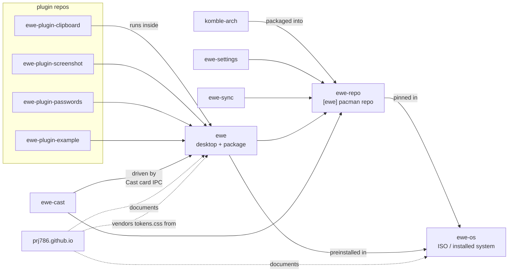

---
tags:
  - ewe-map
  - overview
title: Repository Map
up: "[[Home]]"
---

# Repository Map

The project is **8 product repos + 4 plugin repos** (plus this vault, the
`design-mockups/` folder and dev worktrees in `.wt/`). All under the
`prj786` GitHub org; checked out locally at `/home/scubba/Projects/ewe/`.

| repo | role | stack |
|---|---|---|
| [`ewe`](https://github.com/prj786/ewe) | the desktop environment + `ewe` package + CLI tools + design system | Hyprland, Quickshell/QML, Bash, Python |
| [`ewe-os`](https://github.com/prj786/ewe-os) | the distro: archiso profile → live/install ISO | archiso, bash |
| [`ewe-repo`](https://github.com/prj786/ewe-repo) | the `[ewe]` pacman repository (published to GitHub releases) | pacman, GitHub Actions |
| [`komble-arch`](https://github.com/prj786/komble-arch) | Komble — the software manager | Tauri v2 (Rust) + Svelte 5 + Tailwind 4 |
| [`ewe-settings`](https://github.com/prj786/ewe-settings) | the Settings app | Tauri v2 + Svelte 5 |
| [`ewe-sync`](https://github.com/prj786/ewe-sync) | the account & sync app (RFC-006, ex-"Flock") | Tauri v2 + Svelte 5 |
| [`ewe-cast`](https://github.com/prj786/ewe-cast) | `ewe-castd` — headless casting daemon (RFC-004) | Python on GLib, GStreamer (C) |
| [`prj786.github.io`](https://github.com/prj786/prj786.github.io) | the website | SvelteKit 2 + Svelte 5, static |
| [`ewe-plugin-clipboard`](https://github.com/prj786/ewe-plugin-clipboard) | clipboard history + emoji (shipped, removable) | QML |
| [`ewe-plugin-screenshot`](https://github.com/prj786/ewe-plugin-screenshot) | screenshots (shipped, removable) | QML |
| [`ewe-plugin-passwords`](https://github.com/prj786/ewe-plugin-passwords) | password fill (shipped, removable) | QML, bash |
| [`ewe-plugin-example`](https://github.com/prj786/ewe-plugin-example) | the reference plugin to copy | QML |

## How they depend on each other

Notes on the graph:

- The ISO **pins nothing** — it preconfigures the `[ewe]` repo so live and
  installed systems roll forward with plain `pacman -Syu`. See [[Packaging and Updates]].
- The three shipped plugins are **removable**: `ewe-plugin remove ewe.clipboard`
  deletes them; they can be re-added from their repos.
- ewe-cast is a separate daemon repo but ships in the same package flow and
  is driven entirely from the shell's Cast card. See [[ewe-cast]].

## Per-repo deep dives

[[ewe Desktop]] · [[ewe-os ISO]] · [[ewe-repo]] · [[Komble]] ·
[[ewe-settings]] · [[ewe-sync]] · [[ewe-cast]] · [[Website]]
