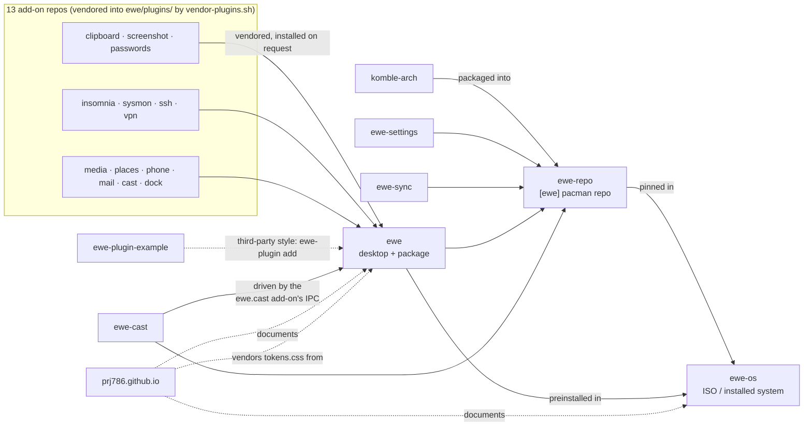

---
tags:
  - ewe-map
  - overview
title: Repository Map
up: "[[Home]]"
---

# Repository Map

The project is **8 product repos + 14 plugin repos** (13 plugins + the
example; plus this vault, the `design-mockups/` folder and dev worktrees in
`.wt/`). All under the `prj786` GitHub org; checked out locally at
`/home/scubba/Projects/ewe/`. The ten `ewe-plugin-*` repos created
2026-10-04 exist locally (`main`, one or two commits each); the lead
creates the GitHub remotes and pushes.

| repo | role | stack |
|---|---|---|
| [`ewe`](https://github.com/prj786/ewe) | the desktop environment + `ewe` package + CLI tools + design system | Hyprland, Quickshell/QML, Bash, Python |
| [`ewe-os`](https://github.com/prj786/ewe-os) | the distro: archiso profile → live/install ISO | archiso, bash |
| [`ewe-repo`](https://github.com/prj786/ewe-repo) | the `[ewe]` pacman repository (published to GitHub releases) | pacman, GitHub Actions |
| [`komble-arch`](https://github.com/prj786/komble-arch) | Komble — the software manager | Tauri v2 (Rust) + Svelte 5 + Tailwind 4 |
| [`ewe-settings`](https://github.com/prj786/ewe-settings) | the Settings app | Tauri v2 + Svelte 5 |
| [`ewe-sync`](https://github.com/prj786/ewe-sync) | the account & sync app (RFC-006, ex-"Flock") | Tauri v2 + Svelte 5 |
| [`ewe-cast`](https://github.com/prj786/ewe-cast) | `ewe-castd` — headless casting daemon (RFC-004) | Python on GLib, GStreamer (C) |
| [`prj786.github.io`](https://github.com/prj786/prj786.github.io) | the website | SvelteKit 2 + Svelte 5, static |
| [`ewe-plugin-clipboard`](https://github.com/prj786/ewe-plugin-clipboard) | plugin: clipboard history + emoji (1.1.1, API 2) | QML |
| [`ewe-plugin-screenshot`](https://github.com/prj786/ewe-plugin-screenshot) | plugin: screenshots (1.1.0, API 2) | QML |
| [`ewe-plugin-passwords`](https://github.com/prj786/ewe-plugin-passwords) | plugin: password fill (1.1.0, API 2) | QML, bash |
| [`ewe-plugin-insomnia`](https://github.com/prj786/ewe-plugin-insomnia) | plugin: Insomnia / keep awake (1.0.0, API 3) | QML |
| [`ewe-plugin-sysmon`](https://github.com/prj786/ewe-plugin-sysmon) | plugin: CPU + memory meters (1.0.0) | QML, sh |
| [`ewe-plugin-ssh`](https://github.com/prj786/ewe-plugin-ssh) | plugin: SSH hosts + tunnels (1.0.0) | QML |
| [`ewe-plugin-vpn`](https://github.com/prj786/ewe-plugin-vpn) | plugin: NetworkManager VPNs (1.0.0) | QML |
| [`ewe-plugin-media`](https://github.com/prj786/ewe-plugin-media) | plugin: Music / MPRIS card (1.0.0) | QML |
| [`ewe-plugin-places`](https://github.com/prj786/ewe-plugin-places) | plugin: Places file browser (1.0.0) | QML |
| [`ewe-plugin-phone`](https://github.com/prj786/ewe-plugin-phone) | plugin: Phone / KDE Connect (1.0.0) | QML, Python |
| [`ewe-plugin-mail`](https://github.com/prj786/ewe-plugin-mail) | plugin: Mail — IMAP + Gmail visuals (1.0.0) | QML |
| [`ewe-plugin-cast`](https://github.com/prj786/ewe-plugin-cast) | plugin: Cast to TV — the shell end of ewe-castd (1.0.0) | QML, sh |
| [`ewe-plugin-dock`](https://github.com/prj786/ewe-plugin-dock) | plugin: the Dock + pinned-apps popup (1.0.0) | QML |
| [`ewe-plugin-example`](https://github.com/prj786/ewe-plugin-example) | the reference plugin to copy (API 2) | QML |

## How they depend on each other

```mermaid
graph LR
    subgraph plugins["13 add-on repos (vendored into ewe/plugins/ by vendor-plugins.sh)"]
        P1["clipboard · screenshot · passwords"]
        P2["insomnia · sysmon · ssh · vpn"]
        P3["media · places · phone · mail · cast · dock"]
    end
    P4["ewe-plugin-example"]

    P1 -->|"vendored, installed on request"| EWE["ewe<br/>desktop + package"]
    P2 --> EWE
    P3 --> EWE
    P4 -.->|"third-party style: ewe-plugin add"| EWE

    CAST["ewe-cast"] -->|"driven by the<br/>ewe.cast add-on's IPC"| EWE

    K["komble-arch"] -->|"packaged into"| REPO["ewe-repo<br/>[ewe] pacman repo"]
    S["ewe-settings"] --> REPO
    SY["ewe-sync"] --> REPO
    EWE --> REPO
    CAST --> REPO

    REPO -->|"pinned in"| OS["ewe-os<br/>ISO / installed system"]
    EWE -->|"preinstalled in"| OS

    WEB["prj786.github.io"] -.->|"documents"| OS
    WEB -.->|"documents"| EWE
    WEB -.->|"vendors tokens.css from"| EWE
```

Notes on the graph:

- The ISO **pins nothing** — it preconfigures the `[ewe]` repo so live and
  installed systems roll forward with plain `pacman -Syu`. See [[Packaging and Updates]].
- The 13 plugins ship **inside the ewe payload** but are **not installed on
  a fresh machine**; `ewe-plugin install <id>` (Komble → Plugins) puts one
  in, `remove` takes it out, `migrate` keeps upgraders' features. Fix an
  plugin in its repo, then re-vendor ([[One repo per add-on]]).
- ewe-cast is a separate daemon repo but ships in the same package flow and
  is driven entirely from the `ewe.cast` plugin. See [[ewe-cast]] · [[Cast Plugin]].

## Per-repo deep dives

[[ewe Desktop]] · [[ewe-os ISO]] · [[ewe-repo]] · [[Komble]] ·
[[ewe-settings]] · [[ewe-sync]] · [[ewe-cast]] · [[Website]] · the plugins
under [[Plugin System]]
