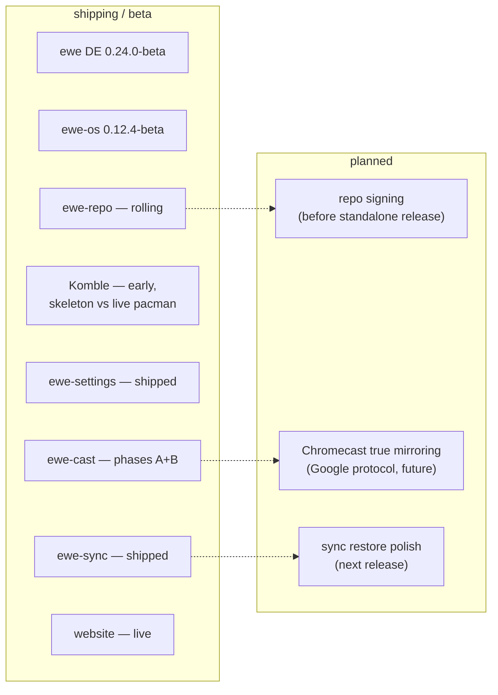

---
tags:
  - ewe-map
  - overview
title: Roadmap and Status
up: "[[Home]]"
---

# Roadmap and Status

Snapshot as of **2026-09-21**. The `VERSION` files say: **ewe (DE) 0.24.0-beta**,
**ewe-os (distro) 0.12.4-beta**. The README speaks of a `0.9.x` beta line and
names the **1.0-beta release "Dolly"**.

## The RFCs

Design decisions are written up as RFCs in `ewe/docs/`. They are the
project's memory:

| RFC | title | status |
|---|---|---|
| RFC-001 | [[The One File]] — `ewe.conf` | **shipping** — phases 1–5 landed in ewe 0.9.0; phase 6 (broker + sync) was the 0.4-alpha centrepiece; target 1.0-beta "Dolly" |
| RFC-002 | [[Auth Broker]] + sync of the one file to Drive | **superseded** for the account half by RFC-005 (2026-09-02); broker + Drive backend remain for the optional Google extras |
| RFC-004 | [[ewe-cast]] — casting without the foreign app | **phases A+B built** (2026-08-30), Miracast proven against a loopback sink; first real-TV field test pending |
| RFC-005 | [[Account and Sync]] — the ewe account is a Nextcloud account | **accepted** (2026-09-02), implemented on a `nextcloud` branch across ewe, komble-arch, ewe-settings, ewe-os and the website; merges as one wave |
| RFC-006 | [[ewe-sync]] — the account app (drafted as "Flock" for an afternoon) | **proposed → built** as a fourth first-party Tauri app, shipped preinstalled from ISO 0.9-alpha on |

## Component status

## Known honest limits

- **Komble is early** — frontend builds, Rust type-checks, but has not yet
  been run against a live pacman.
- **ewe-cast Chromecast** is seconds of latency via HLS — real-time only on
  Miracast today.
- **ewe-repo packages are unsigned** (`SigLevel = Optional TrustAll`);
  signing is planned.
- **ewe-sync cannot create Nextcloud accounts** — Nextcloud has no public
  registration API; it links out to provider signup pages.
- **ewe-sync folder sync** rides `nextcloudcmd` (the Nextcloud client's
  headless engine); no selective sync inside a pair, no bandwidth limits.

## What's next, per component

- [[Roadmap — Desktop and One File]] — Dolly 1.0-beta, theming phases
- [[Roadmap — Komble]] — the first live-pacman run is the gate
- [[Roadmap — ewe-sync]] — folder-sync hardening, restore polish
- [[Roadmap — ewe-cast]] — phase C field proof, Chromecast true mirroring
- [[Roadmap — Distro and Repo]] — repo signing, standalone release
- [[Open Questions]] — deliberately unresolved

## Related

- [[What is ewe]] · [[System Architecture]] · [[The One File]] ·
  [[Decision Index]]
