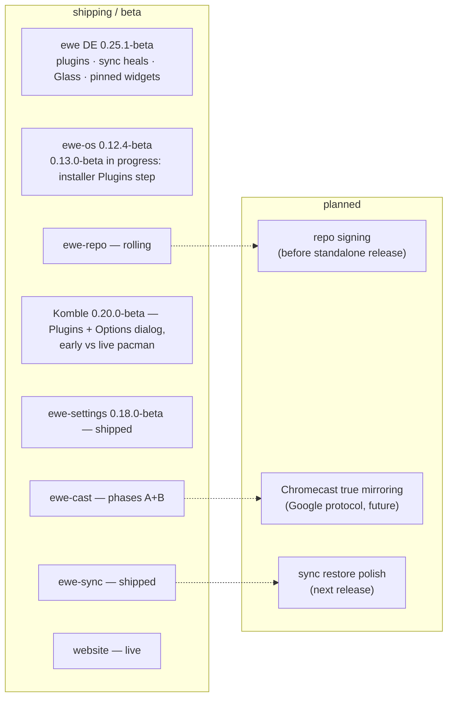

---
tags:
  - ewe-map
  - overview
title: Roadmap and Status
up: "[[Home]]"
---

# Roadmap and Status

Snapshot as of **2026-10-10**. Released: **ewe (DE) 0.25.1-beta** (2026-10-10, with Komble
0.20.0-beta, ewe-settings 0.18.0-beta and ewe-sync 0.14.4-beta; 0.25.0-beta on 2026-10-04), **ewe-os (distro) 0.12.4-beta**
(no ISO for 0.25 yet — the release stopped at the ewe-repo publish; **ewe-os
0.13.0-beta** is in progress on `feat/addons-installer`: the installer's
Plugins step, see [[ewe-os ISO]]). The README speaks of a
`0.9.x` beta line and names the **1.0-beta release "Dolly"**.

## 0.25.1-beta — what is in it (released 2026-10-10)

One wave, branch `fix/plugins-settings-sync` in every repo: ewe#49,
komble-arch#11, ewe-settings#19, ewe-sync#7, ewe-os#16 (installer strings
only — no ISO tag), prj786.github.io#4, plus the ten plugin repos straight
to their `main`s; then the ewe-repo publish. Decisions: [[Decision Index]]
rows 27–31 (D9–D13). Real-hardware testing on the home laptop follows.

| piece | state |
|---|---|
| **Sync** ([[Sync Conflicts Are About Content]]): ewe-conf adopts a moved ETag over bytes it sent/saw, records a stored upload, answers `conflict` + `remote_is_this_machine`, stamps a hashed `machine_id`; ewe-sync's banner/tray key on `conflict`; Cloud.qml reflects/clears it | `tests/ewe-conf-sync-test.sh` green incl. a lost reply, a refused stamp, a same-bytes re-upload and two same-named machines; the laptop still needs one *Push anyway* |
| **"Shell isn't running"** in ewe-settings: re-probe on focus/10 s, timeout, `--pid` retry, stdout-only replies | dev-mock checked (`?shell=down`) |
| **Glass** ([[Glass — the slider moves the bar only]]) | `ewe-theme-test.sh` 106/106 (incl. 5 new checks); nested harness: no QML errors, Lua rules accepted |
| **Plugin settings** ([[Plugin Settings Live With the Plugin]]): Komble Options dialog, `komble --options`, Show in bar (`ewe-plugin bar`), Dock 1.1.0 / Mail 1.1.0 / System monitor 1.1.0 / Music + Places 1.0.2, ewe-settings cleanup | `ewe-plugin-test.sh` 76/76; Komble + Settings dev-mock screenshots; harness: dock resizes live, Show in bar live |
| **Desktop widgets** ([[Desktop Widgets — always movable, pin to a level]]) | harness: overlay above a fullscreen window, top covered by it, live pin/level, arrange chips |
| **One name: plugins** ([[One Name — Plugins]]) | apps, shell, CLI, docs, installer, website, vault |

Open: the laptop needs one ewe-sync *Push anyway* (its record predates the
fix); real-mouse drag of a widget and the three apps in real windows are
checked on the hardware, not in the harness.

## 0.25.0-beta — what is in it (released 2026-10-04)

| piece | branch / repo | state |
|---|---|---|
| **Plugins** (D1–D7): plugin API 3, the `Shell` singleton, `ewe-plugin install/migrate`, `bundle.json`, 13 plugins vendored in `plugins/` (default false, migrate true), Welcome Plugins step | ewe `feat/addons-platform` + `feat/addons-carve-out` → `release/0.25.0-beta` | merged into the release branch; integration (Welcome step, `Shell.toggleOverview/primaryScreenName/dockItems/closePopups`, `VERSION`, phase 90 portal threshold 1.4.1-2.1) in progress |
| the ten new plugin repos (insomnia, sysmon, ssh, vpn, media, places, phone, mail, cast, dock) at **1.0.0**; clipboard **1.1.1**, screenshot/passwords **1.1.0** | `ewe-plugin-*` (local `main`, remotes to be created) | built, harness-tested on the carved shell; real-device check pending |
| **Quiet lid** (A2): guarded `after_sleep_cmd`, per-output re-assert, `probeLid()`, buffered logind bridge; `post_upgrade` refreshes the greeter | ewe `fix/lid-resume-blinks` | merged; laptop test pending |
| **Snappy Overview** (D8): one-step open, `ewe:overview` global shortcut | ewe `fix/overview-snappy` | merged; 130 ms to half-visible measured |
| **X11 scale** = smallest lit scale of the DRM-connected set | ewe `fix/x11-scale-notes` | merged |
| Komble: Plugins catalogue, `--addons`, `plugin_install` | komble-arch `feat/addons` (0.18.1-beta base) | built, dev-mock tested; untested in Tauri |
| ewe-settings: `addons_state`/`open_addons`, plugin aware panes, Insomnia, guarded hypridle | ewe-settings `feat/addons` (0.16.4-beta base) | built, dev-mock tested |
| ewe-os 0.13.0-beta: installer **Plugins step** (live payload catalogue, nothing pre-checked, Summary row), `addons` helper verb → `ewe-install --addons-only` (per user in the chroot, best-effort), `ewe-install --addons` + prompt, live user gets `ewe.dock` | ewe-os `feat/addons-installer` | built; sandbox-proven plugin loop, headless screenshot of the step; not yet tagged/built — QEMU pass pending |

Decisions: [[Decision Index]] rows 16–26. Released as one wave (ewe#46,
komble-arch#10, ewe-settings#18, ewe-map#3), then the ewe-repo publish; no
ISO tag. Real-device checks (lid, plugins on the live box, Komble/Settings in
Tauri) are the open part.

## The RFCs

Design decisions are written up as RFCs in `ewe/docs/`. They are the
project's memory:

| RFC | title | status |
|---|---|---|
| RFC-001 | [[The One File]] — `ewe.conf` | **shipping** — phases 1–5 landed in ewe 0.9.0; phase 6 (broker + sync) was the 0.4-alpha centrepiece; target 1.0-beta "Dolly" |
| RFC-002 | [[Auth Broker]] + sync of the one file to Drive | **superseded** for the account half by RFC-005 (2026-09-02); broker + Drive backend remain for the optional Google extras |
| RFC-004 | [[ewe-cast]] — casting without the foreign app | **phases A+B built** (2026-08-30), Miracast proven against a loopback sink; first real-TV field test pending |
| RFC-005 | [[Account and Sync]] — the ewe account is a Nextcloud account | **accepted** (2026-09-02), implemented on a `nextcloud` branch across ewe, komble-arch, ewe-settings, ewe-os and the website; merges as one wave |
| RFC-006 | [[ewe-sync]] — the account app (drafted as "Flock" for an afternoon) | **proposed → built** as a fourth first-party Tauri app, shipped preinstalled from ISO 0.9-alpha on |

## Component status

```mermaid
flowchart LR
    subgraph shipping["shipping / beta"]
        EWE["ewe DE 0.25.1-beta<br/>plugins · sync heals · Glass · pinned widgets"]
        OS["ewe-os 0.12.4-beta<br/>0.13.0-beta in progress: installer Plugins step"]
        REPO["ewe-repo — rolling"]
        K["Komble 0.20.0-beta — Plugins + Options dialog,<br/>early vs live pacman"]
        S["ewe-settings 0.18.0-beta — shipped"]
        SY["ewe-sync — shipped"]
        CAST["ewe-cast — phases A+B"]
        WEB["website — live"]
    end
    subgraph planned["planned"]
        SIGN["repo signing<br/>(before standalone release)"]
        MIRROR["Chromecast true mirroring<br/>(Google protocol, future)"]
        REST["sync restore polish<br/>(next release)"]
    end
    REPO -.-> SIGN
    CAST -.-> MIRROR
    SY -.-> REST
```

## Known honest limits

- **Komble is early** — frontend builds, Rust type-checks, but has not yet
  been run against a live pacman.
- **ewe-cast Chromecast** is seconds of latency via HLS — real-time only on
  Miracast today.
- **ewe-repo packages are unsigned** (`SigLevel = Optional TrustAll`);
  signing is planned.
- **ewe-sync cannot create Nextcloud accounts** — Nextcloud has no public
  registration API; it links out to provider signup pages.
- **ewe-sync folder sync** rides `nextcloudcmd` (the Nextcloud client's
  headless engine); no selective sync inside a pair, no bandwidth limits.
- **0.25 plugins** — Komble's catalogue and ewe-settings' plugin panes have
  not run in a real Tauri window yet; the quiet-lid fix has not met a real
  lid; a fresh 0.25 install has **no dock** by design.

## What's next, per component

- [[Roadmap — Desktop and One File]] — Dolly 1.0-beta, theming phases
- [[Roadmap — Komble]] — the first live-pacman run is the gate
- [[Roadmap — ewe-sync]] — folder-sync hardening, restore polish
- [[Roadmap — ewe-cast]] — phase C field proof, Chromecast true mirroring
- [[Roadmap — Distro and Repo]] — repo signing, standalone release
- [[Open Questions]] — deliberately unresolved

## Related

- [[What is ewe]] · [[System Architecture]] · [[The One File]] ·
  [[Decision Index]]
