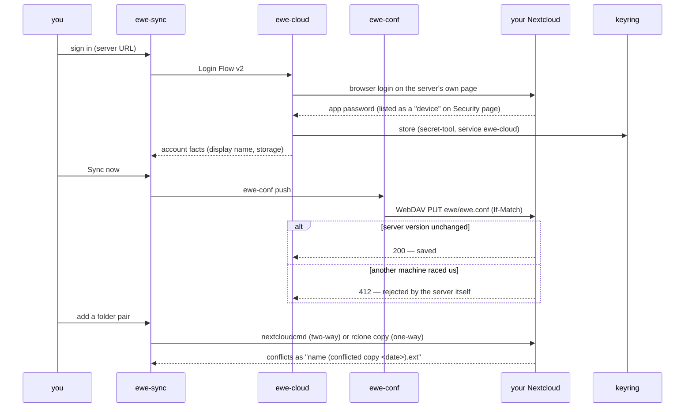

---
tags:
  - ewe-map
  - architecture
title: Account and Sync
up: "[[Home]]"
---

# Account and Sync — Nextcloud, RFC-005 / RFC-006

The ewe account is a **Nextcloud** account. The user signs in to *their*
Nextcloud — self-hosted or a hosted provider (Murena, Disroot, Infomaniak,
…) — through Nextcloud's own browser login flow. Everything ewe syncs lives
in a folder of that account.

**Why Nextcloud (RFC-005):** WebDAV, CalDAV and IMAP need nobody's
verification — no unverified-app warning, no CASA audit, no client secret in
CI. The audience is people who *don't* want Google in their login screen,
and the owner is out of the loop entirely.

## Who does what

| app | job |
|---|---|
| **ewe-sync** | the account app (RFC-006): sign-in, the one file, machines, folders, tray icon. *Nothing else has a sync button.* |
| **`ewe-cloud`** | the account tool shipped in the `ewe` package: Nextcloud Login Flow v2, account facts, the app password |
| **`ewe-conf`** | `push` / `pull` / `sync-status` of the one file, WebDAV with the server's own `If-Match` conflict guard |
| **`nextcloudcmd`** / **`rclone`** | the folder-sync engines (two-way via Nextcloud's engine; one-way copies via rclone) |
| **`ewe-auth`** | only for the keyring playbook (`keyring-reset`) — Google stays optional, see [[Auth Broker]] |

## Login & sync flow

## What is stored where

- **App password** → the keyring only (service `ewe-cloud`). Revocable any
  time in Nextcloud → Settings → Security.
- **Non-secret account facts** (server, login, display name) →
  `~/.config/ewe/cloud.json`.
- **The one file** → locally `~/.config/ewe/ewe.conf`; in the account
  `ewe/ewe.conf`, `ewe/ewe.conf.meta.json` (who saved it, when) and
  `ewe/machines/<name>.json` (each machine's ewe version + app count).
- **Folders** — pairs of a local folder and an account folder, two-way
  (Nextcloud sync engine) or one-way (rclone `copy`: adds and updates,
  never deletes).

## Triggers & conflicts

- Folder sync triggers: **on change** (inotify; a burst of writes becomes
  one run after 5 quiet seconds), **every N minutes**, or **once at login**.
  Automatic runs honour the auto-sync switch; "Sync now" always runs.
- Conflicts: when both sides changed a file, the engine keeps the server's
  version and writes yours as `name (conflicted copy <date>).ext`. The
  Folders pane lists them; *Keep mine* / *Keep theirs* resolves. Only paths
  inside the pair are ever touched.

## Honest limits

- ewe-sync **cannot create accounts** — Nextcloud has no public registration
  API; it links to provider signup pages.
- No selective sync inside a pair (use excludes), no bandwidth limits.
- `nextcloudcmd` flags were written against the documented interface — see
  `ewe-sync/src-tauri/src/folders.rs` → `mod nccmd` if a client version
  disagrees.
- Nothing needs root; there is no privileged helper.

## Related

- [[ewe-sync]] · [[The One File]] · [[Auth Broker]] ·
  [[Sync and Backup Flow]] · [[Roadmap and Status]]
