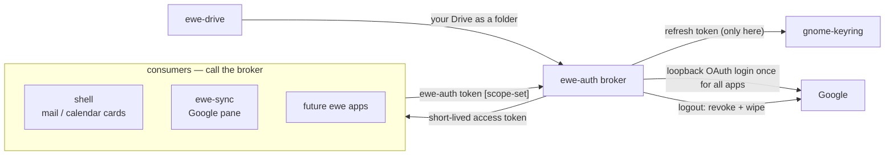

---
tags:
  - ewe-map
  - architecture
title: Auth Broker
up: "[[Home]]"
---

# Auth Broker — `ewe-auth`

`ewe-auth` is a small broker (Python, stdlib + keyring via libsecret CLI or
D-Bus) that owns exactly three things:

1. **the refresh token** — in gnome-keyring, nowhere else, ever;
2. **access tokens** — `ewe-auth token [scope-set]` prints a short-lived
   access token, refreshing under a lock when expired. Shell, Komble and
   future apps call this instead of doing OAuth;
3. **sign-in/out** — `ewe-auth login` runs the loopback-redirect flow once
   for all apps; `ewe-auth logout` revokes + wipes.

**The promise of RFC-002:** *log in, get your machine back* — one Google
identity for every ewe app, and `ewe.conf` syncing behind it. That Google
half is now **superseded** (RFC-005): the account and the sync of the one
file moved to Nextcloud. `ewe-auth` and the Drive backend remain **only for
the optional, bring-your-own-client Google extras** (Gmail unread +
notifications, your Drive mounted as a folder).

## Token flow

## The rules

- **One client id, one consent screen, one sign-out.** The shell's
  `Google.qml` shrank to a *consumer* — profile/mail/calendar reads through
  the broker instead of owning OAuth itself.
- **No Google client ships with ewe.** Google is optional and needs the
  user's own OAuth client file (`oauth-client.json`, a drop-in file swap —
  see `ewe/docs/GOOGLE-CLIENT.md`).
- **Secrets never reach `ewe.conf`** — the file names accounts (an email),
  never credentials. This is rule 4 of [[The One File]].
- **Keyring playbook** — when a prompt keeps rejecting the login password,
  `ewe-auth keyring-reset` (used by ewe-sync).

## Why a broker

Before it, Google OAuth lived inside the shell (`Google.qml`): it owned the
client config, the refresh token, the refresh loop and the sync of its own
caches, while Komble ran a *separate* restore pipeline off files the shell
wrote. The broker deletes that duplication: one token owner, one sign-in,
consumers stay thin.

## Related

- [[The One File]] · [[Account and Sync]] · [[CLI Tools]] ·
  [[Sync and Backup Flow]]

> **Build guard:** the refresh token lives only in the keyring; `ewe-auth`
> is the single thing that touches it; the shipped Google story is
> BYO-client only. Rationale: [[RFC-002 — Auth Broker]].
