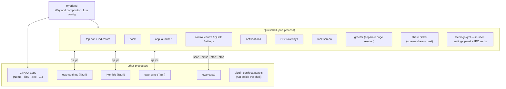

---
tags:
  - ewe-map
  - architecture
title: Desktop Shell
up: "[[Home]]"
---

# Desktop Shell

The desktop is two processes: **Hyprland** (the Wayland compositor, all
Lua-configured) and **Quickshell** (the QML shell). Quickshell owns every
surface that must be a layer-shell surface.

## The shell's pieces

- **Top bar** — indicators for everything (clipboard, screenshot camera,
  casting card, phone battery via KDE Connect, …). Bar widgets are
  pluggable: a plugin's `Widget.qml` gets packed like a built-in indicator.
- **Control centre / Quick Settings** — network, audio, calendar, cast,
  phone — the place ewe-cast lives (see [[Cast Flow]]).
- **Greeter** — runs as its own session: `greetd → cage → Quickshell greeter`.
- **Share picker** — the portal's screen-share picker is backed by the shell
  (`ewe-share-picker`), with live previews and real display names. The same
  picker is reused for casting.

## IPC: `qs ipc`

The shell exposes verbs over IPC. Some are **public API in both directions**
— renaming one breaks installed binaries (ewe's `Settings.qml` documents
`reload`, `ping`, `version`).

| caller | verb | effect |
|---|---|---|
| ewe-settings | `qs ipc call settings reload` | re-read user-theme.json, apply live |
| ewe-sync | `qs ipc call cloud refresh` | refresh the shell's account card |
| clipboard plugin | `qs ipc call ewe.clipboard toggle` | toggle clipboard history |
| cast card | `scan · sinks · start <sink> · stop · status` | drive ewe-castd |
| example plugin | `qs ipc call example.hello toggle` | demo verb |

## Why the shell must stay one process

A QML error in the shell takes the whole desktop down with it — which is
exactly why the big, rarely-open UIs (Settings, Komble, sync) were moved
*out* into Tauri apps. The shell keeps only what must be layer-shell:
bar, dock, notifications, OSD, lock. See [[ewe-settings]] for the reasoning.

## Related

- [[System Architecture]] · [[The One File]] · [[Plugin System]] ·
  [[ewe-cast]] · [[Settings Flow]]

> **Build guard:** everything that must be a layer-shell surface stays
> here; everything that doesn't, moves out (see
> [[Process Split — Shell vs Apps]]). Never rename an IPC verb — they're
> public API with installed binaries ([[Contracts and Public API]]).
