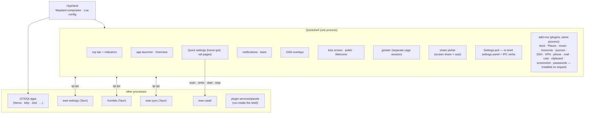

---
tags:
  - ewe-map
  - architecture
title: Desktop Shell
up: "[[Home]]"
---

# Desktop Shell

The desktop is two processes: **Hyprland** (the Wayland compositor, all
Lua-configured) and **Quickshell** (the QML shell). Quickshell owns every
surface that must be a layer-shell surface.

```mermaid
flowchart TB
    HYP["Hyprland<br/>Wayland compositor · Lua config"] --> QS["Quickshell — the QML shell"]

    subgraph QS["Quickshell (one process)"]
        BAR["top bar + indicators"]
        LAUNCH["app launcher · Overview"]
        CC["Quick settings (home grid, rail pages)"]
        NOTIF["notifications · toast"]
        OSD["OSD overlays"]
        LOCK["lock screen · polkit · Welcome"]
        GREET["greeter (separate cage session)"]
        PICK["share picker<br/>(screen share + cast)"]
        SETT["Settings.qml — in-shell settings panel + IPC verbs"]
        ADDONS["add-ons (plugins, same process):<br/>dock · Places · music · Insomnia · sysmon ·<br/>SSH · VPN · phone · mail · cast · clipboard ·<br/>screenshot · passwords — installed on request"]
    end

    subgraph outside["other processes"]
        APPS["GTK/Qt apps<br/>(Nemo · kitty · Zed · …)"]
        T1["ewe-settings (Tauri)"]
        T2["Komble (Tauri)"]
        T3["ewe-sync (Tauri)"]
        CD["ewe-castd"]
        PLUG["plugin services/panels<br/>(run inside the shell)"]
    end

    QS <-->|"qs ipc"| T1
    QS <-->|"qs ipc"| T2
    QS <-->|"qs ipc"| T3
    CC -->|"scan · sinks · start · stop"| CD
    HYP --> APPS
```

## The shell's pieces

**Core (preinstalled):** bar, launcher, Overview, the Quick settings
basics (home, wifi, bt, audio, cal, notifs), notifications, lock, OSD,
polkit, Welcome, greeter, SharePicker. **Everything else is an add-on**
since 0.25 — a plugin in the same process, shipped in the payload, installed
on request ([[Add-ons — opt-in, not preinstalled]], [[Plugin System]]).
A fresh install has **no dock** until the user adds one.

- **Top bar** — indicators; bar widgets and the Quick settings pill's
  glyphs are pluggable (`bar-widget`, `bar-status`); the clipboard
  scissors, screenshot camera, phone and mail glyphs are add-ons'.
- **Quick settings** — a home grid of tiles (built-ins first, then
  add-ons' `quick-tile`s; empty slots collapse) and a rail of pages
  (`quick-page` keys; an unknown key falls back to `home`). Cast, VPN, SSH,
  Mobile and Mail pages come from add-ons (see [[Cast Flow]]).
- **Welcome** — first run; since 0.25 has an **Add-ons step** (nothing
  pre-checked; *Install selected* / *Browse in Komble*).
- **Greeter** — runs as its own session: `greetd → cage → Quickshell greeter`.
- **Share picker** — the portal's screen-share picker is backed by the shell
  (`ewe-share-picker`), with live previews and real display names. The same
  picker is reused for casting.

## IPC: `qs ipc`

The shell exposes verbs over IPC. Some are **public API in both directions**
— renaming one breaks installed binaries (ewe's `Settings.qml` documents
`reload`, `ping`, `version`).

| caller | verb | effect |
|---|---|---|
| ewe-settings | `qs ipc call settings reload` | re-read user-theme.json, apply live |
| ewe-sync | `qs ipc call cloud refresh` | refresh the shell's account card |
| clipboard add-on | `qs ipc call ewe.clipboard toggle` | toggle clipboard history |
| cast add-on | `qs ipc call ewe.cast scan · start <sink> · stop · status · legacy` (alias `cast`) | drive ewe-castd |
| dock add-on | `qs ipc call launcher toggle` (alias of `ewe.dock launcher`) | the pinned-apps popup |
| Hyprland `global` | `ewe:overview` (Super, release bind) | toggle the Overview |
| example plugin | `qs ipc call example.hello toggle` | demo verb |

Add-ons that replaced built-ins keep the old target as an **alias**
(`cast launcher places player mail`) — Rule 4; the full list is in
[[IPC Verb Reference]].

## Why the shell must stay one process

A QML error in the shell takes the whole desktop down with it — which is
exactly why the big, rarely-open UIs (Settings, Komble, sync) were moved
*out* into Tauri apps. The shell keeps only what must be layer-shell:
bar, notifications, OSD, lock — and the add-ons the user chose (a dock is
layer-shell too, so it is a plugin *in* the process, not a separate one).
See [[ewe-settings]] for the reasoning.

## Related

- [[System Architecture]] · [[The One File]] · [[Plugin System]] ·
  [[ewe-cast]] · [[Settings Flow]]

> **Build guard:** everything that must be a layer-shell surface stays
> here; everything that doesn't, moves out (see
> [[Process Split — Shell vs Apps]]). Never rename an IPC verb — they're
> public API with installed binaries ([[Contracts and Public API]]).
