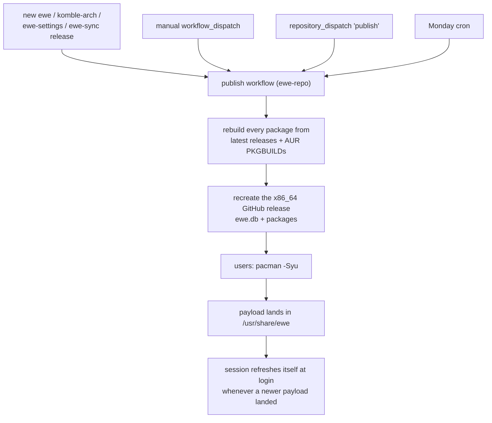

---
tags:
  - ewe-map
  - architecture
title: Packaging and Updates
up: "[[Home]]"
---

# Packaging and Updates

The DE is a **normal package in a normal pacman repository**. Add `[ewe]`
to `/etc/pacman.conf` and `sudo pacman -Syu` updates the desktop like any
other package — no special updater, no version pinning.

## The repository (`ewe-repo`)

The rolling **x86_64** release of ewe-repo *is* the repository: `ewe.db`
plus every package, hosted as a GitHub release:

```ini
[ewe]
SigLevel = Optional TrustAll
Server = https://github.com/prj786/ewe-repo/releases/download/x86_64
```

`pacman -S ewe` installs the payload to `/usr/share/ewe` plus **every
dependency**: the full package lists from the ewe repo, plus Komble,
ewe-settings and ewe-sync, plus prebuilt copies of the AUR packages listed
in `aur-packages.txt`. The payload carries the account tools — `ewe-cloud`,
`ewe-caldav`, `ewe-mail`, `ewe-conf` with its WebDAV sync — and **no Google
client**.

## The publish pipeline



## What the `ewe` package does on a machine

Two steps, deliberately split:

| step | tool | what |
|---|---|---|
| per-user | `ewe-setup` | deploys the installed payload into the user's session (config, dotfiles, plugins) |
| system | `/usr/share/ewe/install.sh` | greeter stack (greetd → cage → Quickshell greeter), plymouth, hibernate |

## Known state

- Packages are currently **unsigned** (`SigLevel = Optional TrustAll`);
  repo signing is planned before the standalone-distro release.
- The ISO pins nothing — it preconfigures `[ewe]` so both the live session
  and installed systems roll forward with plain `pacman -Syu`.

## Related

- [[ewe-repo]] · [[ewe-os ISO]] · [[Update Flow]] · [[Install Flow]] ·
  [[System Architecture]]

> **Build guard:** the repo stays `Optional TrustAll` until signing ships
> (one wave: workflow + docs + install.sh + ISO); then flip the docs here.
> See [[Unsigned Repo — for now]] and [[Release Checklist]].
