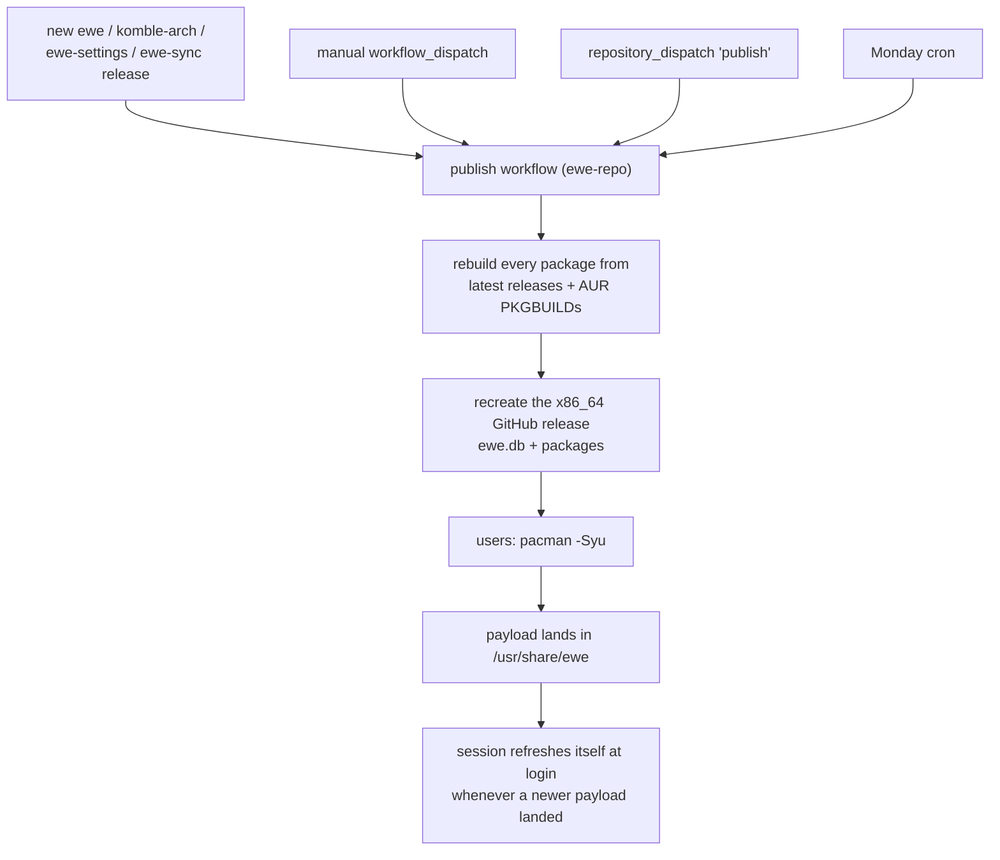

---
tags:
  - ewe-map
  - architecture
title: Packaging and Updates
up: "[[Home]]"
---

# Packaging and Updates

The DE is a **normal package in a normal pacman repository**. Add `[ewe]`
to `/etc/pacman.conf` and `sudo pacman -Syu` updates the desktop like any
other package — no special updater, no version pinning.

## The repository (`ewe-repo`)

The rolling **x86_64** release of ewe-repo *is* the repository: `ewe.db`
plus every package, hosted as a GitHub release:

```ini
[ewe]
SigLevel = Optional TrustAll
Server = https://github.com/prj786/ewe-repo/releases/download/x86_64
```

`pacman -S ewe` installs the payload to `/usr/share/ewe` plus **every
dependency**: the full package lists from the ewe repo, plus Komble,
ewe-settings and ewe-sync, plus prebuilt copies of the AUR packages listed
in `aur-packages.txt`. The payload carries the account tools — `ewe-cloud`,
`ewe-caldav`, `ewe-mail`, `ewe-conf` with its WebDAV sync — and **no Google
client**.

## The publish pipeline


```mermaid
flowchart TB
    TRIG1["new ewe / komble-arch /<br/>ewe-settings / ewe-sync release"]
    TRIG2["manual workflow_dispatch"]
    TRIG3["repository_dispatch 'publish'"]
    TRIG4["Monday cron"]

    TRIG1 --> PUB["publish workflow (ewe-repo)"]
    TRIG2 --> PUB
    TRIG3 --> PUB
    TRIG4 --> PUB

    PUB --> BUILD["rebuild every package from<br/>latest releases + AUR PKGBUILDs"]
    BUILD --> REL["recreate the x86_64 GitHub release<br/>ewe.db + packages"]
    REL --> USERS["users: pacman -Syu"]
    USERS --> PAY["payload lands in /usr/share/ewe"]
    PAY --> REFRESH["session refreshes itself at login<br/>whenever a newer payload landed"]
```

## What the `ewe` package does on a machine

Two steps, deliberately split:

| step | tool | what |
|---|---|---|
| per-user | `ewe-setup` | deploys the installed payload into the user's session (config, dotfiles); runs `ewe-plugin seed` (bundle `default` ids — none in 0.25 — plus a refresh of installed bundled copies) then `ewe-plugin migrate` (once per add-on, upgraders only — [[Add-ons — one-time migration for upgraders]]) |
| system | `bash /usr/share/ewe/install.sh --no-packages` — **as your user, never `sudo`** (it exits 2 under sudo: `$HOME` would be `/root` and the session entry would point there) | greeter stack (greetd → cage → Quickshell greeter), fonts, PAM, plymouth, hibernate, phase 30's DNS/cast setup |
| on `pacman -Syu` | the package's `post_upgrade` (0.25) | a **system-side refresh of the greeter only** — the `ewe-greeter` wrapper (shipped as `system/greeter/ewe-greeter`), `shell.qml` and `theme-tokens.json` — where phase 30 had run before; fonts, greetd `config.toml` and PAM still need `install.sh` |

## Known state

- Packages are currently **unsigned** (`SigLevel = Optional TrustAll`);
  repo signing is planned before the standalone-distro release.
- The ISO pins nothing — it preconfigures `[ewe]` so both the live session
  and installed systems roll forward with plain `pacman -Syu`.
- The payload carries the **13 add-ons** under `/usr/share/ewe/plugins/`
  with `bundle.json`; none is installed on a fresh machine
  ([[Add-ons — vendored payload and bundle.json]]).
- Open: `uninstall.sh` never removes `/usr/local/bin/ewe-greeter`.

## Related

- [[ewe-repo]] · [[ewe-os ISO]] · [[Update Flow]] · [[Install Flow]] ·
  [[System Architecture]]

> **Build guard:** the repo stays `Optional TrustAll` until signing ships
> (one wave: workflow + docs + install.sh + ISO); then flip the docs here.
> See [[Unsigned Repo — for now]] and [[Release Checklist]].
