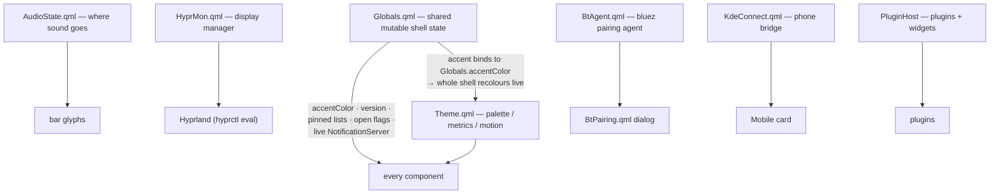

---
tags:
  - ewe-map
  - architecture
title: Shell Singletons
up: "[[Home]]"
---

# Shell Singletons — the shell's inner architecture

`shell.qml`'s `ShellRoot` instantiates every top-level component (`Bar`,
`Dock`, `QuickSettings`, `Settings`, `AppStore`, `Notifications`, …);
components are registered in `qmldir`. Two singletons tie everything
together — plus the specialist state owners. This is the state map of the
shell process (from `ewe/CLAUDE.md`):

## Globals.qml

Shared mutable shell state: `quickSettingsOpen`, `settingsOpen`,
`accentColor`, `version`, pinned lists, the live `NotificationServer`, …
**In-shell toggles flip a `Globals` bool directly — no IPC round-trip.**
(IPC is for *external* callers.)

## Theme.qml

The palette/metrics. `accent` binds to `Globals.accentColor`, so changing
the accent recolours the whole shell live. Values come from `bin/ewe-theme`
(scheme + accent in `ewe.conf` → every token of the Ewe design system v3).
One property per v3 token, `Theme.type.<style>` for type, the motion table
(`durFast/Base/Slow/Dim`, OutCubic + InOutCubic, no OutBack), the Glass
trio (`glass`, `barAlpha`, `glassBlur`), accessibility modes. **No raw
colour/size/duration in QML** — literals live only in `bin/ewe-theme` and
as Theme.qml fallbacks. See [[Theming Pipeline]].

> **Gotcha:** `onAccent: <expr>` beside a property called `accent` parses as
> a signal handler — declare the token bare and fill it with a `Binding`.

## AudioState.qml — the follow-the-device policy

Where sound goes: headset / headphones / external / built-in (from the
default sink's PipeWire properties), the level, whether an app has the mic
open (a link from the default source to a stream — Quickshell 0.3.1 never
reports link STATE, so "open" is the signal). Policy: **a headset that
appears becomes the output (and input); output returns to where it was when
the headset leaves.** (WirePlumber won't do this once a user ever picked a
default.) The bar's sound and mic glyphs read it.

## HyprMon.qml — displays

Per-monitor-set profiles (`display-profiles.json` →
`hypr/generated/monitors.lua`), live apply via
`hyprctl eval 'hl.monitor{…}'`, re-assert on hotplug/AC events. The Settings
app also generates `input.lua` and `wallpapers.conf` — but `monitors.lua`
and `hypridle.conf` stay **shell-generated by design** (runtime-reactive;
never move them into `ewe.conf`).

## BtAgent.qml — bluetooth

The bluez pairing agent (`scripts/bt-agent.py`, default `org.bluez.Agent1`,
NDJSON over stdio like `KdeConnect.qml`); `BtPairing.qml` is its dialog.
Device state comes from `Quickshell.Bluetooth`; pairing/connecting go
through `BtAgent.pair()/connectDevice()` so failures have a reason.
`bin/ewe-bt` is the same for the Settings app.

## KdeConnect.qml — the phone bridge

Quickshell has no generic QML D-Bus client (its D-Bus features are compiled
C++ types), so `scripts/kdeconnect-bridge.py` (dbus-python + GLib) owns
every KDE Connect D-Bus call and speaks **newline-delimited JSON over
stdio** to the singleton — events out (devices, pair state, battery,
notifications, SMS), commands in. See [[Phone and VPN]].

## Shared idioms

- **Drag-out** (Places, screenshot preview): an invisible proxy `Item` with
  `Drag.active` + `Drag.mimeData: ({"text/uri-list": "file://"+path+"\r\n"})`,
  plus a box-only `mask: Region { item: box }` so clicks/drags outside the
  panel pass through to apps behind.
- **PluginHost** — loads `~/.config/ewe/plugins/<id>/`, desktop widgets,
  arrange mode; `plugins reload` re-reads placement + settings without a
  restart. Inside a Scope use `Variants`, never `Repeater`.

## Related

- [[Desktop Shell]] · [[Theming Pipeline]] · [[Phone and VPN]] ·
  [[Contracts and Public API]]
