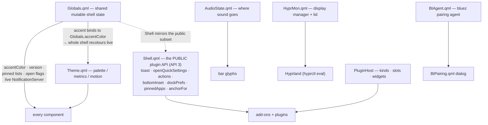

---
tags:
  - ewe-map
  - architecture
title: Shell Singletons
up: "[[Home]]"
---

# Shell Singletons — the shell's inner architecture

`shell.qml`'s `ShellRoot` instantiates every top-level component (`Bar`,
`QuickSettings`, `Launcher`, `Overview`, `Notifications`, `Toast`, `Lock`,
`Osd`, `Auth`, `SharePicker`, `Welcome`, the lazy `Settings`/`AppStore`
fallbacks, …); components are registered in `qmldir`. **Since 0.25 `Dock`,
`PinnedApps`/`LauncherPanel`, `Places`, `MediaPlayer`, `Caffeine`, the
meters, `Ssh`, `Vpn`, `KdeConnect`, `Mail` and `Cast` are gone from the
core — they are add-ons** ([[Plugin System]]). Three singletons tie
everything together — plus the specialist state owners. This is the state
map of the shell process (from `ewe/CLAUDE.md`):

```mermaid
flowchart TB
    G["Globals.qml — shared mutable shell state"] --> |"accentColor · version ·<br/>pinned lists · open flags ·<br/>live NotificationServer"| ALL["every component"]
    T["Theme.qml — palette / metrics / motion"] --> ALL
    G -->|"accent binds to Globals.accentColor<br/>→ whole shell recolours live"| T
    SH["Shell.qml — the PUBLIC plugin API (API 3)<br/>toast · openQuickSettings · actions ·<br/>bottomInset · dockPrefs · pinnedApps · anchorFor"] --> PLUG["add-ons + plugins"]
    G -.->|"Shell mirrors the public subset"| SH

    AUDIO["AudioState.qml — where sound goes"] --> BAR["bar glyphs"]
    MON["HyprMon.qml — display manager + lid"] --> HYPR["Hyprland (hyprctl eval)"]
    BT["BtAgent.qml — bluez pairing agent"] --> PAIR["BtPairing.qml dialog"]
    HOST["PluginHost — kinds · slots · widgets"] --> PLUG
```

## Shell.qml — the plugin-facing API (0.25)

Frozen for API 3 ([[Plugin API 3]], table in [[Contracts and Public API]]).
Reads mirror `Globals` (`overviewOpen`, `quickSettingsOpen`, `lowPower`,
`onBattery`, `locked`, `dnd`, `dockPrefs`, `pinnedApps`), plus what the
host computes: `bottomInset` / `bottomReserved` / `dockPresent` (published
by a dock plugin via `setBottomInset(id, px, reserved)` — every panel that
read `Theme.dockClearance` / `Globals.dockEnabled` for layout reads this
now), `activeCount`, `dockItems`, `primaryScreenName`, `popupsClosing`.
Calls: `toast`, `openQuickSettings(tab)`, `openSettings(page)` (forwards
`--page`), `openStore(page)` (`komble --addons`), `launch`, `focusApp`,
`registerAction`/`runAction`, `setActive`/`isActive`,
`setDockItemShown`/`dockItemShown`, `setPinned`, `anchorFor(item, window)`,
`toggleOverview()`, `closePopups(exceptId)` (one add-on popup at a time).
Signals `aboutToSleep()` (logind bridge) and `resumed()` (Resume step 6).

## Globals.qml

Shared mutable shell state: `quickSettingsOpen`, `settingsOpen`,
`accentColor`, `version`, pinned lists, the live `NotificationServer`, …
**In-shell toggles flip a `Globals` bool directly — no IPC round-trip.**
(IPC is for *external* callers.)

## Theme.qml

The palette/metrics. `accent` binds to `Globals.accentColor`, so changing
the accent recolours the whole shell live. Values come from `bin/ewe-theme`
(scheme + accent in `ewe.conf` → every token of the Ewe design system v3).
One property per v3 token, `Theme.type.<style>` for type, the motion table
(`durFast/Base/Slow/Dim`, OutCubic + InOutCubic, no OutBack), the Glass
trio (`glass`, `barAlpha`, `glassBlur`), accessibility modes. **No raw
colour/size/duration in QML** — literals live only in `bin/ewe-theme` and
as Theme.qml fallbacks. See [[Theming Pipeline]].

> **Gotcha:** `onAccent: <expr>` beside a property called `accent` parses as
> a signal handler — declare the token bare and fill it with a `Binding`.

## AudioState.qml — the follow-the-device policy

Where sound goes: headset / headphones / external / built-in (from the
default sink's PipeWire properties), the level, whether an app has the mic
open (a link from the default source to a stream — Quickshell 0.3.1 never
reports link STATE, so "open" is the signal). Policy: **a headset that
appears becomes the output (and input); output returns to where it was when
the headset leaves.** (WirePlumber won't do this once a user ever picked a
default.) The bar's sound and mic glyphs read it.

## HyprMon.qml — displays (and the lid)

Per-monitor-set profiles (`display-profiles.json` →
`hypr/generated/monitors.lua`), live apply via
`hyprctl eval 'hl.monitor{…}'`, re-assert on hotplug/AC events. The Settings
app also generates `input.lua` and `wallpapers.conf` — but `monitors.lua`
and `hypridle.conf` stay **shell-generated by design** (runtime-reactive;
never move them into `ewe.conf`).

Since 0.25 (A2, [[Quiet Lid — touch only a disabled panel]]): re-asserts
are **per output and minimal** — `applyMatching` → `verifyOne` issues
`hl.monitor` only for an output that does not already match; `force` only
for *Reset displays*; lid-open re-enables only a disabled panel with its
saved spec. `HyprMon.probeLid()` re-reads `/proc/acpi/button/lid/*/state`
before every sleep decision (a stale `lidClosed` re-slept the machine after
a hibernate resume). The X11 scale decided at login reads the DRM-connected
set, not `lastKey` ([[X11 Scale — smallest lit scale]]).

## BtAgent.qml — bluetooth

The bluez pairing agent (`scripts/bt-agent.py`, default `org.bluez.Agent1`,
NDJSON over stdio like `KdeConnect.qml`); `BtPairing.qml` is its dialog.
Device state comes from `Quickshell.Bluetooth`; pairing/connecting go
through `BtAgent.pair()/connectDevice()` so failures have a reason.
`bin/ewe-bt` is the same for the Settings app.

## The phone bridge — moved to the Phone add-on (0.25)

Quickshell has no generic QML D-Bus client (its D-Bus features are compiled
C++ types), so a Python bridge (dbus-python + GLib) owns every KDE Connect
D-Bus call and speaks **newline-delimited JSON over stdio** to a singleton —
events out (devices, pair state, battery, notifications, SMS), commands
in. Since 0.25 that bridge and its `Phone` singleton live in the
[[Phone Plugin]] (`kdeconnect-bridge.py` in `pluginDir`); the same NDJSON
pattern remains in the core as `BtAgent` and the logind bridge. See
[[Phone and VPN]].

## Shared idioms

- **Drag-out** (the Places add-on, screenshot preview): an invisible proxy
  `Item` with `Drag.active` + `Drag.mimeData: ({"text/uri-list":
  "file://"+path+"\r\n"})`, plus a box-only `mask: Region { item: box }` so
  clicks/drags outside the panel pass through to apps behind.
- **PluginHost** — loads `~/.config/ewe/plugins/<id>/` (API 2 and 3),
  slots the `quick-tile` / `quick-page` / `bar-status` / `dock-item` kinds
  into the host surfaces, desktop widgets, arrange mode; `plugins reload`
  re-reads placement + settings without a restart. Inside a Scope use
  `Variants`, never `Repeater`; a `Loader` must never bind `visible` to
  `item.visible`.
- **AnchoredPopup** — the per-screen popup card plugins open at
  `Shell.anchorFor(item, window)`; a top-edge card clears the bar, a
  bottom-edge one clears `Shell.bottomInset`.

## Related

- [[Desktop Shell]] · [[Theming Pipeline]] · [[Phone and VPN]] ·
  [[Contracts and Public API]] · [[Plugin API 3]] · [[Plugin System]]
