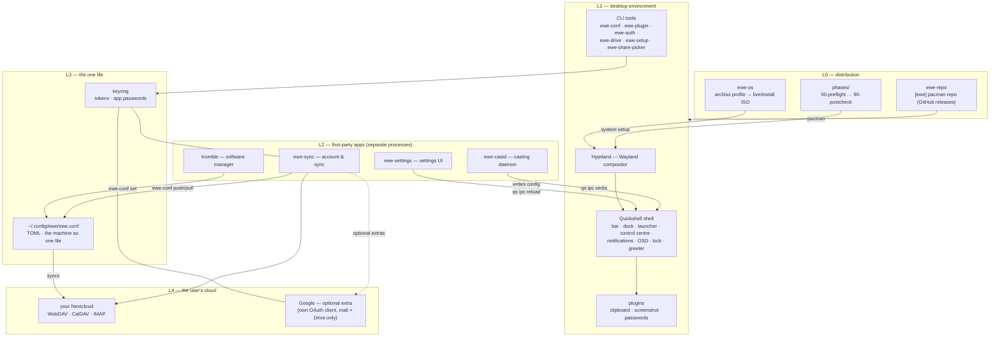

---
tags:
  - ewe-map
  - architecture
title: System Architecture
up: "[[Home]]"
---

# System Architecture

ewe is a layered system. Each layer is a separate repo/process with one
well-defined way of talking to the others — mostly **files** (the one file,
user-theme.json) and **CLI tools** (`ewe-conf`, `qs ipc`).

## The layers

## The rules that hold it together

1. **One writer for config** — nothing but `ewe-conf` writes `ewe.conf`:   not the shell, not ewe-settings, not Komble, not the installer. See [[The One File]].
2. **Secrets never enter the file** — the file syncs to the cloud, so it may
   name accounts, never credentials. Tokens live in the keyring behind
   [[Auth Broker]].
3. **The shell owns surfaces; apps own windows** — everything that must be a
   layer-shell surface (bar, dock, OSD, lock) stays in Quickshell; Tauri
   cannot create layer-shell surfaces at all, so Komble/settings/sync are
   ordinary windows in their own processes. See [[ewe-settings]].
4. **Apps talk through the shell's IPC** — `qs ipc call settings reload`,
   `qs ipc call ewe.clipboard toggle`, `qs ipc call cloud refresh`.
5. **Everything is a front end to a CLI** — anything clickable is scriptable
   and debuggable by running the same command. See [[CLI Tools]].

> **Build guard:** any new feature must respect all five rules — a second
> config writer, a secret in a synced file, or a Tauri layer-surface are
> the three cardinal mistakes. Full invariants: [[Rules of the House]].

## Cross-cutting threads

- **Theming** — one token layer (`tokens.css` from [[Design System]])
  feeds shell, GTK, apps and even the website.
- **Updating** — pacman rolls the DE forward; the session refreshes itself
  at login when a newer payload landed. See [[Update Flow]].
- **Identity** — one Nextcloud account for sync/mail/calendars; one
  optional Google identity for everything Google, via the broker.

## Related

- [[Repository Map]] · [[Desktop Shell]] · [[The One File]] ·
  [[Packaging and Updates]] · [[Sync and Backup Flow]]
