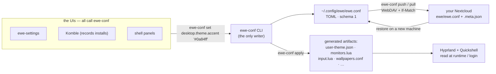

---
tags:
  - ewe-map
  - architecture
title: The One File
up: "[[Home]]"
---

# The One File — `ewe.conf`

> In Linux everything is a file; in ewe **the machine is one file**.
> — RFC-001

Every piece of desktop and system configuration a user can express lives in
one declarative TOML document, `~/.config/ewe/ewe.conf`. Settings UIs edit
it, one tool applies it, everything else is generated from it. **Save the
file, restore the machine.**

## The rules

1. **One canonical file** — `ewe.conf`, TOML, human-readable, diffable,
   comment headers regenerated on write.
2. **One writer** — the `ewe-conf` CLI. Nothing else ever writes the file:
   not the shell, not ewe-settings, not the installer, not Komble.
3. **Everything else is generated** — runtime files (`user-theme.json`,
   `monitors.lua`, `input.lua`, `wallpapers.conf`, …) are *build artifacts*
   of `ewe-conf apply`. Hand edits survive until the next apply.
4. **Secrets never enter the file** — the file syncs to the cloud; it may
   name accounts, never credentials. Tokens live in the keyring behind
   [[Auth Broker]].
5. **Live-apply stays with the UIs** — UIs apply instantly (e.g. `hyprctl
   eval`), then persist by writing *through* `ewe-conf`, which regenerates.

## Data flow



## Why one file

Before RFC-001 the config surface was **~14 files** kept consistent by TWO
byte-identical generator implementations (the in-shell Settings panel and
ewe-settings) — a contract enforced by care, not architecture. One file with
one generator deletes the drift class entirely and makes **sync, backup and
install the same operation: produce the file, apply the file.**

## What lives in it (schema v1)

```toml
schema = 1

[desktop.theme]        # ← user-theme.json today
color_scheme = "dark"          # dark (light parked)
accent = "#0a84ff"
theme_name = "flock"           # flock | blacksheep
tint_borders = true
window_transparency = 1.0

[desktop.dock]
enabled = true
autohide = false
icon_size = "medium"
# … monitors, input, apps.installed (Komble), sync.folders (ewe-sync), …
```

- `[apps.installed]` — every install Komble makes, with its source
  (`repo` / `aur` / `first-party`) — this is what "For you" reads back.
- `[sync.folders]` — the folder pairs ewe-sync manages.
- `[desktop.theme]` — feeds [[Design System]] (`ewe-theme build` derives the
  whole token layer from the active scheme + accent).

## Status

Phases 1–5 landed in ewe 0.9.0. Phase 4 (static artifacts) done; `hypridle.conf`
and `monitors.lua` stay shell-generated **by design** — they are
runtime-reactive on battery/hotplug. Phase 6 (broker + sync) became
RFC-005/RFC-006 — see [[Account and Sync]].

> **Build guard:** don't "finish" the one-file migration by moving
> `hypridle.conf`/`monitors.lua` into `ewe.conf`; don't write the file from
> anywhere but `ewe-conf`; don't put a secret in it. Rationale:
> [[RFC-001 — The One File]].

## Related

- [[System Architecture]] · [[CLI Tools]] · [[Account and Sync]] ·
  [[Settings Flow]] · [[Sync and Backup Flow]]
