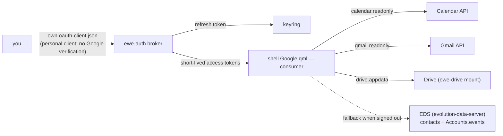

---
tags:
  - ewe-map
  - component
title: Google Extras
up: "[[Home]]"
---

# Google Extras — the optional, BYO-client Google stack

Google is **not the account** (that's Nextcloud, RFC-005) and ewe ships **no
Google client**. It's an extra: Gmail in the Control Centre and Drive as a
folder — powered by the user's own OAuth client file
(`~/.config/ewe/oauth-client.json`, type *Desktop app*, Gmail + Drive APIs;
see `ewe/docs/GOOGLE-CLIENT.md`). ewe-sync → Google says whether the file
parses and connects. Settings sync **never** uses Google; an IMAP mail
account, when set up, takes precedence over Gmail.

## Who does what

## The operations (how it actually runs)

- **Calendar** — 14-day window over every selected calendar
  (`calendarList` → `events.list`, `singleEvents`, per-calendar colours),
  polled every 15 min + on sign-in + when Quick Settings opens stale;
  cached to `google-events.json` (offline shows the last sync). Reminders
  honour per-event/calendar popup overrides (else 10-min lead), fire
  through the shell's own notification server via `notify-send`, de-duped
  across restarts in `google-notified.json`.
- **Gmail** (read-only) — `labels.get(INBOX)` feeds the unread badge (bar
  envelope + Mail tile); `users.history.list` with a persisted `historyId`
  cursor detects genuinely new arrivals (**404 → silent re-baseline**;
  first sync marks existing unread as seen so sign-in never floods
  notifications); rows are metadata-only (From/Subject/Date + snippet,
  never bodies), deep-linking to Gmail in the browser. Poll: 2 min + on QS
  open when stale. State: `google-mail.json`. Tokens minted before the
  `gmail.readonly` scope get `mailState=scope` → a "Reconnect Google" pill.
- **Drive** — `ewe-drive setup|mount|unmount|status` mounts Drive as a
  folder (personal client only; the shipped project client's Drive scope is
  appData for the legacy RFC-002 bundle).
- **Auth** — `scripts/google-auth.py` (stdlib Python): PKCE + random-port
  `127.0.0.1` loopback redirect, browser via `xdg-open`. Access tokens live
  in shell memory, single-flight refreshed with queued waiters; `api()`
  injects Bearer and retries exactly once on 401. Sign-out revokes at
  Google and clears everything.

## The degrade-cleanly rules (the house pattern)

- not configured → actionable message (no spinners)
- signed out / offline → cached or empty states
- keyring missing → explicit install hint
- boot-race safe: the signed-in probe retries with backoff (gnome-keyring
  may come up after the shell); a failed fetch retries every minute (Wi-Fi
  may connect after the shell); Quick Settings renders cached events
  without waiting — sign-out clears caches so nothing stale leaks.

## Caches (all non-secret, gitignored)

`google-profile.json` (name/email/avatar only) · `google-events.json` ·
`google-mail.json` · `google-notified.json` · `google-oauth.json` (client
id/secret) — under `~/.config/quickshell/`. The refresh token is keyring-only.

## Scope tiers (the ceiling Google imposes)

| scope | tier | unverified client |
|---|---|---|
| openid/email/profile | basic | fine |
| drive.appdata | non-sensitive | fine |
| calendar.readonly | sensitive | works, "unverified" warning |
| gmail.readonly | **restricted** | **blocked** except ≤100 test users; full = CASA audit |

> **Build guard:** don't promise Gmail for everyone — 100 test-users is the
> honest maximum without a CASA verification budget. Personal clients are
> unverified-but-unrestricted; that's why BYO-client is the default story.
> Policy rationale: [[RFC-002 — Auth Broker]].

## Related

- [[Auth Broker]] · [[Account and Sync]] · [[RFC-005 — Nextcloud Account]] ·
  [[CLI Tools]]
