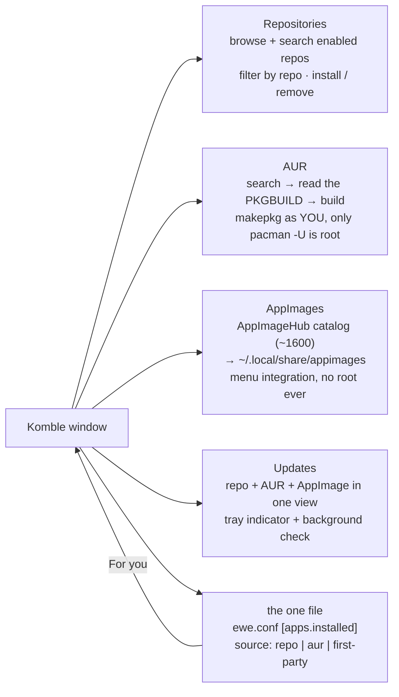

---
tags:
  - ewe-map
  - component
title: Komble
up: "[[Home]]"
---

# Komble — the software manager

`~/Projects/ewe/komble-arch` · [github.com/prj786/komble-arch](https://github.com/prj786/komble-arch)

A compact app store for **Arch Linux** — your repositories, the **AUR**, and
**AppImages**, in one window. Built with **Tauri v2 (Rust) + Svelte 5 +
Tailwind 4**, so it ships as a small native binary rather than a browser in
a trenchcoat.

> **Status: early.** The frontend builds and the Rust type-checks, but this
> has not yet been run against a live pacman. Treat it as a working skeleton.

## What it does

- **The one file** — every install/removal is recorded through `ewe-conf`
  (as you, no root) with its source. **For you** reads that list back and
  offers whatever another ewe machine recorded that is missing here.
- **Komble never syncs** — it never fetches or restores the file itself;
  the account and the restore live in [[ewe-sync]] (RFC-005). A restore done
  there shows up in For you on the next look.

## What Arch forced (not stylistic choices)

Structural differences vs the earlier Debian-targeted build — Arch is not
Debian with different command names:

1. **There is no per-package upgrade** — upgrading one package against a
   newer sync database is a *partial upgrade*, unsupported on Arch. Updates
   mean: refresh the databases, upgrade everything.
2. **AUR builds are user builds** — `makepkg` runs as *you*; only the final
   `pacman -U` is privileged (via a polkit helper). Reading the PKGBUILD
   first is a first-class part of the flow.
3. **AppImages are per-user by nature** — `~/.local/share/appimages`,
   no root at any point.
4. *(the fourth lives in the README's "four things" section — see the repo
   for the full accounting)*

## Related

- [[The One File]] · [[ewe-sync]] · [[Update Flow]] · [[ewe-repo]] ·
  [[Roadmap and Status]]

> **Build guard:** no per-package upgrades, no shell in the privilege
> path, PKGBUILD on screen before any AUR build, and Komble never syncs
> the file. The full reasoning: [[Komble — Arch Forced Decisions]].
