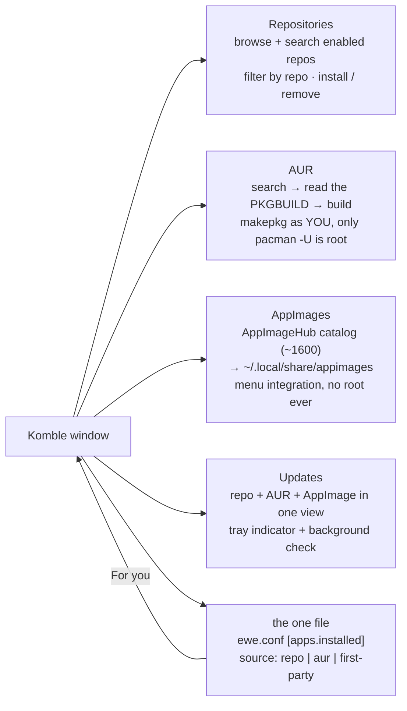
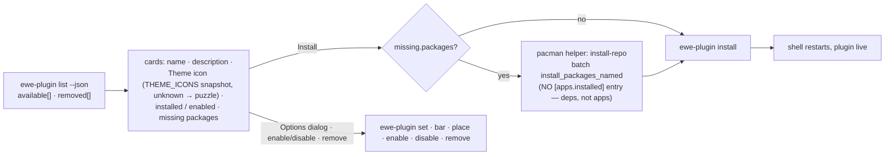

---
tags:
  - ewe-map
  - component
title: Komble
up: "[[Home]]"
---

# Komble — the software manager

`~/Projects/ewe/komble-arch` · [github.com/prj786/komble-arch](https://github.com/prj786/komble-arch)

A compact app store for **Arch Linux** — your repositories, the **AUR**, and
**AppImages**, in one window. Built with **Tauri v2 (Rust) + Svelte 5 +
Tailwind 4**, so it ships as a small native binary rather than a browser in
a trenchcoat.

> **Status: early.** The frontend builds and the Rust type-checks, but this
> has not yet been run against a live pacman. Treat it as a working skeleton.

## What it does

```mermaid
flowchart LR
    K["Komble window"] --> REPO["Repositories<br/>browse + search enabled repos<br/>filter by repo · install / remove"]
    K --> AUR["AUR<br/>search → read the PKGBUILD → build<br/>makepkg as YOU, only pacman -U is root"]
    K --> AI["AppImages<br/>AppImageHub catalog (~1600)<br/>→ ~/.local/share/appimages<br/>menu integration, no root ever"]
    K --> UPD["Updates<br/>repo + AUR + AppImage in one view<br/>tray indicator + background check"]
    K --> ONEFILE["the one file<br/>ewe.conf [apps.installed]<br/>source: repo | aur | first-party"]
    ONEFILE -->|"For you"| K
```

- **The one file** — every install/removal is recorded through `ewe-conf`
  (as you, no root) with its source. **For you** reads that list back and
  offers whatever another ewe machine recorded that is missing here.
- **Komble never syncs** — it never fetches or restores the file itself;
  the account and the restore live in [[ewe-sync]] (RFC-005). A restore done
  there shows up in For you on the next look.

## The Plugins catalogue (0.25, branch `feat/addons`)

Komble is the **one-click installer for ewe's plugins** — the sidebar entry
is **Plugins** (the page was titled *Add-ons* in 0.25.0 —
[[One Name — Plugins]]; first group *From ewe*), and the core shell
deep-links to it: `Shell.openStore("addons")` → `komble --addons` (alias
`--plugins`); ewe-settings' "Open Plugins" does the same, and its "Dock
options" runs `komble --options=ewe.dock`.

```mermaid
flowchart LR
    LIST["ewe-plugin list --json<br/>available[] · removed[]"] --> CARDS["cards: name · description ·<br/>Theme icon (THEME_ICONS snapshot, unknown → puzzle) ·<br/>installed / enabled · missing packages"]
    CARDS -->|"Install"| PKGS{"missing.packages?"}
    PKGS -->|yes| HELPER["pacman helper: install-repo<br/>batch install_packages_named<br/>(NO [apps.installed] entry — deps, not apps)"]
    PKGS -->|no| INST["ewe-plugin install <id>"]
    HELPER --> INST
    INST --> SHELL["shell restarts, plugin live"]
    CARDS -->|"Options dialog · enable/disable · remove"| TOOL["ewe-plugin set · bar · place · enable · disable · remove"]
```

- Komble **never decides what is missing** — the catalogue (`missing`) does
  ([[Add-on deps declared, not split]]); an older ewe without `available`
  hides the group.
- **Options… opens a Dialog** (`PluginOptions.svelte`, bits-ui, the
  AppDetail pattern; 2026-10-10, D10): *Settings* (manifest schema — bool
  Toggle, int, choice as a segmented control (≤3) or Select, colour,
  string; `description` under the label), *In the bar* (Show in bar →
  `plugin_bar` → `ewe-plugin bar`), *On the desktop* (Pinned, When pinned
  top/overlay, Lock position, Shown, Position Reset / Arrange… →
  `plugin_place` → `ewe-plugin place --pinned/--pin-level/--locked/
  --visible/--reset`). Changes apply at once; *Done* closes; Esc/✕ close,
  the scrim does nothing. It used to open inline under the WHOLE card grid
  — off-screen. Toasts name the setting's label, not its key.
- Public CLI flags: `--updates --settings --search[=q] --addons --plugins
  --options[=]<id>` (`komble --search` is also the desktop's gnome-software
  stand-in; `--options` opens a plugin's Options dialog).
- dev-mock: `?options=<id>` opens a dialog (`acme.clock`, `ewe.dock`,
  `ewe.sysmon`).
- Open: `plugin_create` KINDS in `plugins.rs` still list API 2 kinds — add
  the four API 3 kinds. Untested in a real Tauri window (dev-mock only).

## What Arch forced (not stylistic choices)

Structural differences vs the earlier Debian-targeted build — Arch is not
Debian with different command names:

1. **There is no per-package upgrade** — upgrading one package against a
   newer sync database is a *partial upgrade*, unsupported on Arch. Updates
   mean: refresh the databases, upgrade everything.
2. **AUR builds are user builds** — `makepkg` runs as *you*; only the final
   `pacman -U` is privileged (via a polkit helper). Reading the PKGBUILD
   first is a first-class part of the flow.
3. **AppImages are per-user by nature** — `~/.local/share/appimages`,
   no root at any point.
4. *(the fourth lives in the README's "four things" section — see the repo
   for the full accounting)*

## Related

- [[The One File]] · [[ewe-sync]] · [[Update Flow]] · [[ewe-repo]] ·
  [[Roadmap and Status]] · [[Plugin System]] · [[Add-ons — opt-in, not preinstalled]]

> **Build guard:** no per-package upgrades, no shell in the privilege
> path, PKGBUILD on screen before any AUR build, and Komble never syncs
> the file. The full reasoning: [[Komble — Arch Forced Decisions]].
> Plugins: Komble never decides what is missing (the catalogue does) and
> never records a plugin's package dependencies as apps.
