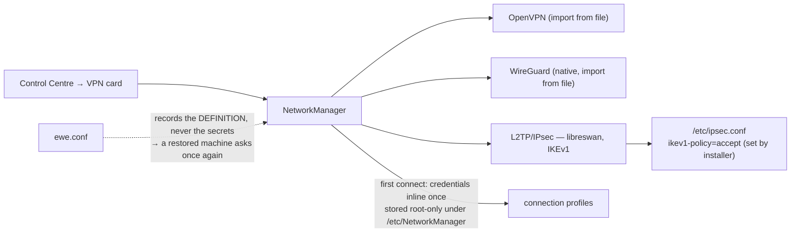

---
tags:
  - ewe-map
  - component
title: Phone and VPN
up: "[[Home]]"
---

# Phone link & VPN — the optional integrations

Two optional system integrations, both driven from the Control Centre, both
built on existing daemons (no reimplementation).

## Phone (KDE Connect)

The Control Centre's **Mobile** card pairs an Android phone through **KDE
Connect's daemon** — only the daemon; the UI is all ewe:

- device discovery + pairing (both directions)
- phone battery in the bar
- the phone's notifications (read, dismiss, inline-reply)
- **SMS** — full conversation list and thread view with send, right in the
  control centre

**Plumbing:** `kdeconnect` ships in the package set (phase 20);
`kdeconnectd` is started by autostart and D-Bus-activated on demand; the
shell talks to it through `scripts/kdeconnect-bridge.py` — Quickshell has no
generic QML D-Bus client, so the Python bridge owns every D-Bus call and
speaks NDJSON over stdio to `KdeConnect.qml` (same pattern as BtAgent — see
[[Shell Singletons]]).

**Secrets/state:** pairing keys stay in kdeconnectd; the shell persists
only seen-notification ids (unread badge) and the chosen device
(`kdeconnect-state.json`). MMS bodies often aren't exposed over D-Bus —
threads label them instead of showing garbage.

## VPN

ewe ships the NetworkManager plugins for **OpenVPN** and **L2TP/IPsec**
(the corporate/ISP kind: server, username, password, pre-shared key);
**WireGuard** is native.

**The L2TP gotcha:** L2TP/IPsec *is* IKEv1, and strongSwan 6.1 as Arch
ships it no longer speaks it — every L2TP profile fails with "The VPN
service failed to start" (`journalctl -u NetworkManager` shows "Could not
establish IPsec connection"). The installer ships **libreswan** with
`ikev1-policy=accept`. Re-running `install.sh` (or `--check-only` to look)
swaps the backend and flips the policy.

Add a VPN in Settings → Network → Add VPN (L2TP from four facts, OpenVPN/
WireGuard from file) or `nmcli connection import type openvpn file x.ovpn`.

## Related

- [[Shell Singletons]] · [[Google Extras]] · [[System Architecture]] ·
  [[Troubleshooting Knowledge]]
