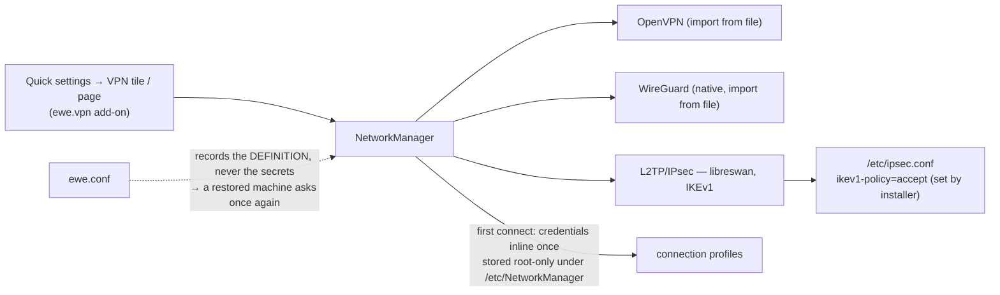

---
tags:
  - ewe-map
  - component
title: Phone and VPN
up: "[[Home]]"
---

# Phone link & VPN — the optional integrations

Two optional system integrations, both driven from Quick settings, both
built on existing daemons (no reimplementation).

> **Add-ons since 0.25:** the phone UI is the [[Phone Plugin]] (`ewe.phone`,
> repo `prj786/ewe-plugin-phone`) and the VPN tile/page is the [[VPN Plugin]]
> (`ewe.vpn`, repo `prj786/ewe-plugin-vpn`); the SSH tile/page is the
> [[SSH Plugin]] (`ewe.ssh`). Neither is installed on a fresh machine
> (Komble → Add-ons or `ewe-plugin install <id>`). What stays **core**: the
> `network.vpn` / `network.ssh` ewe-conf sections, the NM backends, the
> libreswan setup and the ewe-settings Network pane; the Auth secret prompt.

## Phone (KDE Connect)

The **Mobile** page (`quicksettings tab mobile`) pairs an Android phone
through **KDE Connect's daemon** — only the daemon; the UI is all ewe:

- device discovery + pairing (both directions)
- phone battery in the bar
- the phone's notifications (read, dismiss, inline-reply)
- **SMS** — full conversation list and thread view with send, right in the
  control centre

**Plumbing:** `kdeconnect` ships in the package set (phase 20, declared in
the add-on's `requires`); `kdeconnectd` is started by the add-on's service
when missing and D-Bus-activated on demand; the add-on talks to it through
its own `kdeconnect-bridge.py` (run from `pluginDir`) — Quickshell has no
generic QML D-Bus client, so the Python bridge owns every D-Bus call and
speaks NDJSON over stdio to the `Phone` singleton (same pattern as BtAgent
— see [[Shell Singletons]]).

**Secrets/state:** pairing keys stay in kdeconnectd; the shell persists
only seen-notification ids (unread badge) and the chosen device
(`kdeconnect-state.json`). MMS bodies often aren't exposed over D-Bus —
threads label them instead of showing garbage.

## VPN

ewe ships the NetworkManager plugins for **OpenVPN** and **L2TP/IPsec**
(the corporate/ISP kind: server, username, password, pre-shared key);
**WireGuard** is native.

```mermaid
flowchart LR
    CC["Quick settings → VPN tile / page<br/>(ewe.vpn add-on)"] --> NM["NetworkManager"]
    NM --> OV["OpenVPN (import from file)"]
    NM --> WG["WireGuard (native, import from file)"]
    NM --> L2TP["L2TP/IPsec — libreswan, IKEv1"]
    L2TP --> IPSEC["/etc/ipsec.conf<br/>ikev1-policy=accept (set by installer)"]
    NM -->|"first connect: credentials inline once<br/>stored root-only under /etc/NetworkManager"| PROFILE["connection profiles"]
    ONEFILE["ewe.conf"] -.->|"records the DEFINITION, never the secrets<br/>→ a restored machine asks once again"| NM
```

**The L2TP gotcha:** L2TP/IPsec *is* IKEv1, and strongSwan 6.1 as Arch
ships it no longer speaks it — every L2TP profile fails with "The VPN
service failed to start" (`journalctl -u NetworkManager` shows "Could not
establish IPsec connection"). The installer ships **libreswan** with
`ikev1-policy=accept`. Re-running `install.sh` (or `--check-only` to look)
swaps the backend and flips the policy.

> **Build guard:** DNS belongs to systemd-resolved (phase 30:
> `10-ewe-dns.conf` `dns=systemd-resolved`, resolv.conf → the stub). A plain
> resolv.conf lets a VPN client own every lookup — Tailscale wrote
> `100.100.100.100` and nothing resolved with it down ("only the VPN works",
> 0.24.1-beta).

Add a VPN in Settings → Network → Add VPN (L2TP from four facts, OpenVPN/
WireGuard from file) or `nmcli connection import type openvpn file x.ovpn`.

## Related

- [[Phone Plugin]] · [[VPN Plugin]] · [[SSH Plugin]] · [[Shell Singletons]] ·
  [[Google Extras]] · [[System Architecture]] · [[Troubleshooting Knowledge]]
