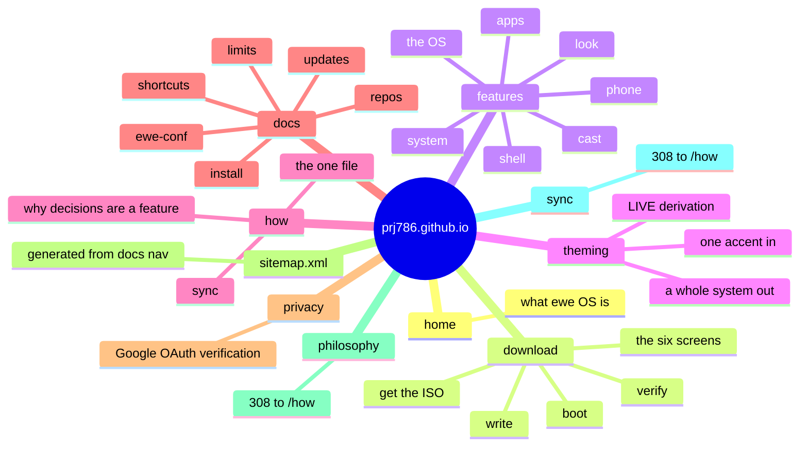

---
tags:
  - ewe-map
  - component
title: Website
up: "[[Home]]"
---

# Website — prj786.github.io

`~/Projects/ewe/prj786.github.io` · [github.com/prj786/prj786.github.io](https://github.com/prj786/prj786.github.io) ·
live at **[prj786.github.io](https://prj786.github.io)**

The site for ewe — the install path, the feature tour, the philosophy, the
docs.

## Stack

SvelteKit 2 + Svelte 5, prerendered to static HTML with
`@sveltejs/adapter-static`. Every route is server-rendered **at build
time**, so GitHub Pages serves finished markup — no client-side rendering.
No analytics, no cookies, no third-party requests: Inter (the desktop's own
face) is self-hosted as two variable woff2 subsets, weight 400–700 plus the
optical-size axis.

## Routes



## The theme connection

`src/tokens.css` is **VENDORED from `ewe/design/tokens.css`** — the site
wears the desktop's own design tokens, with the site's own layer on top
(`src/app.css`: rhythm, type scale, components). See [[Design System]].

## Develop / deploy

```sh
npm install && npm run dev     # http://localhost:5173
npm run build && npm run preview
```

Pushing to `main` runs `.github/workflows/deploy.yml`, which builds and
publishes to GitHub Pages (repo setting: Pages → Source → GitHub Actions).

## Related

- [[Design System]] · [[ewe-os ISO]] · [[Mockups and Screenshots]]
