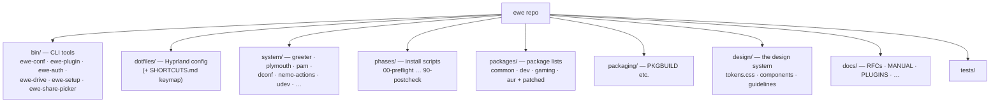

---
tags:
  - ewe-map
  - component
title: ewe Desktop
up: "[[Home]]"
---

# ewe — the Desktop Environment

`~/Projects/ewe/ewe` · [github.com/prj786/ewe](https://github.com/prj786/ewe) ·
**0.22.1-beta** · GPL-2.0-only

The repo you actually look at: **Hyprland** (Wayland compositor,
Lua-configured) with a **Quickshell** QML shell — bar, dock, launcher,
notifications, control centre, lock, OSD, greeter, silent Plymouth boot,
three bundled plugins, the CLI tools, and the `ewe` package that installs
the lot.

## What's inside the repo

## The user-facing surface

- **Shell** — bar, dock, launcher, control centre, lock, OSD, greeter. See [[Desktop Shell]].
- **Shell singletons** — Globals, Theme, AudioState, HyprMon, BtAgent, the
  KDE Connect bridge. See [[Shell Singletons]].
- **Bundled plugins** (removable) — [[Clipboard Plugin]], [[Screenshot Plugin]], [[Passwords Plugin]].
- **CLI tools** — every GUI is a front end to one of these. See [[CLI Tools]].
- **Design system** — `design/` (v3): tokens derived from the active scheme
  + accent; the website vendors `tokens.css` from here. See [[Design System]]
  and [[Theming Pipeline]].
- **Extras** — optional [[Google Extras]], [[Phone and VPN]], [[ewe-cast]].

## Install paths

- **Whole OS** — the ISO (recommended). See [[ewe-os ISO]], [[Install Flow]].
- **Just the DE on Arch** — `sudo pacman -S ewe` from [[ewe-repo]], then
  `ewe-setup` (per-user) and `/usr/share/ewe/install.sh` (system).
- **Hacking** — clone, `bash install.sh` (symlink farm, prompts before each
  change), `./update.sh` (pull + converge + restart the shell). Both are
  idempotent and back up every config they touch; `uninstall.sh` restores.

## Keymap (top of `dotfiles/hypr/SHORTCUTS.md`)

`Super+Return` terminal · `Super+D` apps · `Super+P` fill a login ·
`Super+,` Settings.

## Related

- [[System Architecture]] · [[Desktop Shell]] · [[CLI Tools]] ·
  [[Repo Layout]] · [[Roadmap and Status]]
