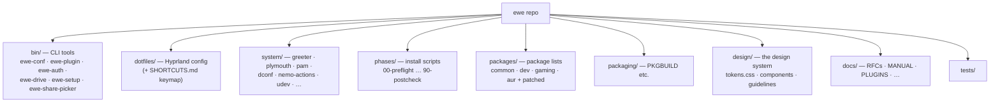

---
tags:
  - ewe-map
  - component
title: ewe Desktop
up: "[[Home]]"
---

# ewe — the Desktop Environment

`~/Projects/ewe/ewe` · [github.com/prj786/ewe](https://github.com/prj786/ewe) ·
**0.24.1-beta** released · **0.25.0-beta in progress** on
`release/0.25.0-beta` (not released) · GPL-2.0-only

The repo you actually look at: **Hyprland** (Wayland compositor,
Lua-configured) with a **Quickshell** QML shell — bar, launcher, Overview,
notifications, Quick settings, lock, OSD, greeter, silent Plymouth boot —
plus **13 plugins** vendored in `plugins/` (none installed on a fresh
machine — [[Add-ons — opt-in, not preinstalled]]), the CLI tools, and the
`ewe` package that installs the lot.

**Since 0.25 the dock (+ pinned-apps popup), Places, the music player,
Insomnia (keep awake), the CPU/memory meters, SSH, VPN, the phone (KDE
Connect), mail (+ the Gmail half of Google.qml) and Cast are NOT shell
components — they are plugins** (`ewe.dock ewe.places ewe.media
ewe.insomnia ewe.sysmon ewe.ssh ewe.vpn ewe.phone ewe.mail ewe.cast`,
repos `prj786/ewe-plugin-<name>`), carved out 2026-10-04 on top of plugin
API 3. Their prefs (`desktop.dock.*`, `apps.pinned`, `apps.places`,
`network.*`, the mail account) stay in `ewe.conf`; the shell exposes what
they need through the `Shell` singleton.

## What's inside the repo

```mermaid
flowchart TB
    EWE["ewe repo"] --> BIN["bin/ — CLI tools<br/>ewe-conf · ewe-plugin · ewe-auth ·<br/>ewe-drive · ewe-setup · ewe-share-picker"]
    EWE --> DOT["dotfiles/ — Hyprland config<br/>(+ SHORTCUTS.md keymap)"]
    EWE --> SYS["system/ — greeter · plymouth · pam ·<br/>dconf · nemo-actions · udev · …"]
    EWE --> PH["phases/ — install scripts<br/>00-preflight … 90-postcheck"]
    EWE --> PACK["packages/ — package lists<br/>common · dev · gaming · aur + patched"]
    EWE --> PACKAGING["packaging/ — PKGBUILD etc."]
    EWE --> DESIGN["design/ — the design system<br/>tokens.css · components · guidelines"]
    EWE --> DOCS["docs/ — RFCs · MANUAL · PLUGINS · …"]
    EWE --> TESTS["tests/"]
```

## The user-facing surface

- **Shell core** — bar, launcher, Overview, Quick settings basics,
  notifications, lock, OSD, polkit, Welcome, greeter. See [[Desktop Shell]].
- **Shell singletons** — Globals, Theme, **Shell** (the plugin-facing API),
  AudioState, HyprMon, BtAgent. See [[Shell Singletons]].
- **Plugins** (in the payload, installed on request — Komble → Plugins,
  Welcome, `ewe-plugin install <id>`) — [[Clipboard Plugin]],
  [[Screenshot Plugin]], [[Passwords Plugin]], [[Insomnia Plugin]],
  [[System Monitor Plugin]], [[SSH Plugin]], [[VPN Plugin]], [[Music Plugin]],
  [[Places Plugin]], [[Phone Plugin]], [[Mail Plugin]], [[Cast Plugin]],
  [[Dock Plugin]]. Model: [[Plugin System]].
- **CLI tools** — every GUI is a front end to one of these. See [[CLI Tools]].
- **Design system** — `design/` (v3): tokens derived from the active scheme
  + accent; the website vendors `tokens.css` from here. See [[Design System]]
  and [[Theming Pipeline]].
- **Extras** — optional [[Google Extras]], [[Phone and VPN]], [[ewe-cast]].

## Install paths

- **Whole OS** — the ISO (recommended). See [[ewe-os ISO]], [[Install Flow]].
- **Just the DE on Arch** — `sudo pacman -S ewe` from [[ewe-repo]], then
  `ewe-setup` (per-user) and `bash /usr/share/ewe/install.sh --no-packages`
  (system side, **as your user — never sudo**; it exits 2 under sudo).
- **Hacking** — clone, `bash install.sh` (symlink farm, prompts before each
  change), `./update.sh` (pull + converge + restart the shell). Both are
  idempotent and back up every config they touch; `uninstall.sh` restores.

## Keymap (top of `dotfiles/hypr/SHORTCUTS.md`)

`Super+Return` terminal · `Super+D` apps · `Super` (tap, the `ewe:overview`
global shortcut) Overview · `Super+,` Settings · `Super+P` fill a login and
`Super+Shift+C` cast exist only while their plugins are enabled.

## Related

- [[System Architecture]] · [[Desktop Shell]] · [[CLI Tools]] ·
  [[Repo Layout]] · [[Roadmap and Status]]
