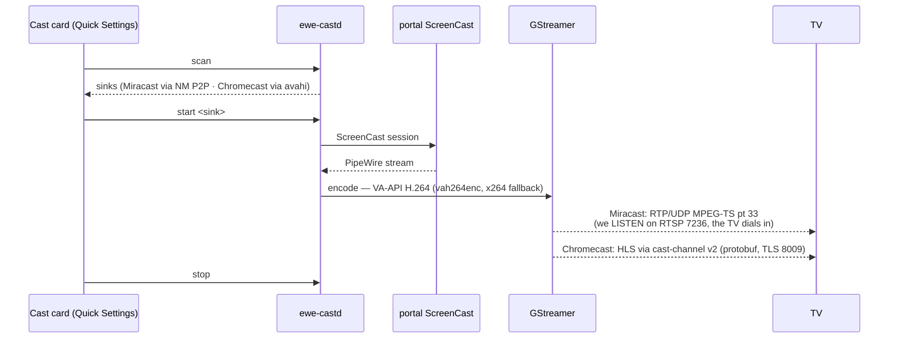

---
tags:
  - ewe-map
  - component
title: ewe-cast
up: "[[Home]]"
---

# ewe-cast — the headless casting daemon

`~/Projects/ewe/ewe-cast` · [github.com/prj786/ewe-cast](https://github.com/prj786/ewe-cast) ·
**RFC-004** · phases A+B built (2026-08-30), Miracast proven against a
loopback sink — first real-TV field test pending

**Casting without the foreign app.** Today ewe's Cast card spawns
`gnome-network-displays` — a gtk4/libadwaita window in a DE that deliberately
has neither, driven by SIGTERM. The screen-sharing *plumbing* is already
ours (xdg-desktop-portal + PipeWire + the shell's own SharePicker); only the
sink protocols live in that app. `ewe-castd` moves them into a headless
daemon so the whole flow lives in Quick Settings.

## The user flow (all in Control Centre)

1. **Cast card** → expands to a sink list (live scan: Miracast peers via
   NetworkManager P2P, Chromecasts via avahi).
2. **Pick a sink** → the shell's **SharePicker** opens (the same one screen
   share uses): output / window / region.
3. **Sharing.** The card shows the sink name + a stop button. No window ever.

## Architecture

- **Sink A — Miracast**: NetworkManager Wi-Fi P2P D-Bus + a hand-rolled WFD
  RTSP source (verified against gnome-network-displays' behavior). This is
  the **real-time** path.
- **Sink B — Chromecast**: avahi discovery + cast-channel v2, Default Media
  Receiver playing a local HLS stream — seconds of latency, honest;
  Google's true mirroring protocol is a future milestone.

> One implementation note vs the original RFC: the daemon is **Python on
> GLib**, not Rust. The media heavy lifting is all C (GStreamer); what's
> left is IO-bound protocol logic.

## Related

- [[Cast Flow]] · [[Desktop Shell]] · [[Roadmap and Status]]

> **Build guard:** it's Python on GLib — a documented RFC-004 deviation,
> not a bug; revisit only if profiling demands. gnd stays behind
> `qs ipc call cast legacy` until phase C. Before debugging any cast bug,
> run the four known failure classes:
> [[Troubleshooting Knowledge]].
