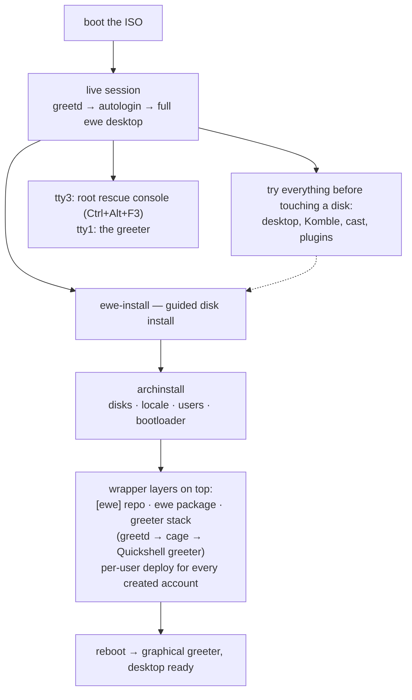

---
tags:
  - ewe-map
  - component
title: ewe-os ISO
up: "[[Home]]"
---

# ewe-os — the Distro / ISO

`~/Projects/ewe/ewe-os` · [github.com/prj786/ewe-os](https://github.com/prj786/ewe-os) ·
**0.12.4-beta** (distro has its own version line; the DE's `ewe` package has another)

The distro layer: the **archiso profile** that builds the live/install ISO.
The DE, apps and packaging live in their own repos — this one turns them
into a bootable distribution.

## Build

```sh
sudo pacman -S archiso
sudo ./build.sh          # → out/ewe-0.1-alpha-x86_64.iso
./run-iso.sh             # boot it in QEMU/KVM (UEFI)
```

The profile (`iso/`) derives from archiso's **releng v89**: its full rescue
toolbox is kept, networkd/iwd are swapped for NetworkManager (what the DE
uses), and greetd + the live user service are enabled on top.

## What the ISO does



- **First start** — the DE deploys itself via `ewe-setup` from the
  preinstalled `ewe` package, at boot, under the plymouth splash.
- **Rolling forward** — the ISO pins nothing; the `[ewe]` pacman repo is
  preconfigured, so live and installed systems update with plain
  `pacman -Syu`. See [[Packaging and Updates]].

## The installer app

`installer/` is a **Tauri GUI (`ewe-installer`)** — the guided install's
face. The backend still rides archinstall for disks/locale/users/bootloader
(the README's contract), then layers the `[ewe]` repo, the `ewe` package,
the greeter stack and the per-user deploy.

## Docs in-repo

- `docs/INSTALL.md` — the install guide
- `docs/TROUBLESHOOTING.md` — problems

## Related

- [[Install Flow]] · [[ewe-repo]] · [[ewe Desktop]] · [[Website]]
