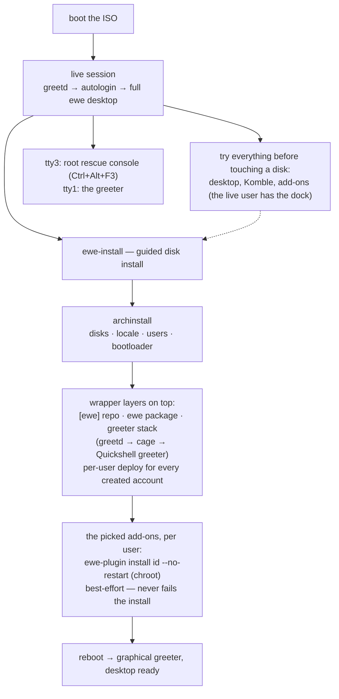

---
tags:
  - ewe-map
  - component
title: ewe-os ISO
up: "[[Home]]"
---

# ewe-os — the Distro / ISO

`~/Projects/ewe/ewe-os` · [github.com/prj786/ewe-os](https://github.com/prj786/ewe-os) ·
**0.12.4-beta** released · **0.13.0-beta in progress** on `feat/addons-installer` (the ISO for ewe 0.25's add-ons; distro has its own version line; the DE's `ewe` package has another)

The distro layer: the **archiso profile** that builds the live/install ISO.
The DE, apps and packaging live in their own repos — this one turns them
into a bootable distribution.

## Build

```sh
sudo pacman -S archiso
sudo ./build.sh          # → out/ewe-0.1-alpha-x86_64.iso
./run-iso.sh             # boot it in QEMU/KVM (UEFI)
```

The profile (`iso/`) derives from archiso's **releng v89**: its full rescue
toolbox is kept, networkd/iwd are swapped for NetworkManager (what the DE
uses), and greetd + the live user service are enabled on top.

## What the ISO does


```mermaid
flowchart TB
    BOOT["boot the ISO"] --> LIVE["live session<br/>greetd → autologin → full ewe desktop"]
    LIVE --> TRY["try everything before touching a disk:<br/>desktop, Komble, add-ons (the live user has the dock)"]
    LIVE --> TT3["tty3: root rescue console (Ctrl+Alt+F3)<br/>tty1: the greeter"]
    LIVE --> INSTALL["ewe-install — guided disk install"]

    INSTALL --> AI["archinstall<br/>disks · locale · users · bootloader"]
    AI --> LAYER["wrapper layers on top:<br/>[ewe] repo · ewe package · greeter stack<br/>(greetd → cage → Quickshell greeter)<br/>per-user deploy for every created account"]
    LAYER --> ADDONS["the picked add-ons, per user:<br/>ewe-plugin install id --no-restart (chroot)<br/>best-effort — never fails the install"]
    ADDONS --> REBOOT["reboot → graphical greeter, desktop ready"]

    TRY -.-> INSTALL
```

- **First start** — the DE deploys itself via `ewe-setup` from the
  preinstalled `ewe` package, at boot, under the plymouth splash.
- **Rolling forward** — the ISO pins nothing; the `[ewe]` pacman repo is
  preconfigured, so live and installed systems update with plain
  `pacman -Syu`. See [[Packaging and Updates]].

## The installer app

`installer/` is a **Tauri GUI (`ewe-installer`)** — the guided install's
face (RFC-003 in `ewe-os/docs/`): Welcome · Network · Time & place · Disk ·
Your account · **Add-ons** (0.13.0-beta) · Summary · Install. Nothing
privileged runs in the app: every step is a verb of the pkexec'd
`installer/helper/ewe-install-helper` (`partition mkfs pacstrap hibernate
settz setlocale sethostname user layer upgrade addons bootloader reboot`);
`layer` and `addons` delegate to `ewe-install --layer-only` /
`--addons-only` — one implementation, two faces.

**The Add-ons step** lists every add-on the live payload carries
(`/usr/share/ewe/plugins/bundle.json` + manifests, read by the backend's
`addons` command — no user config needed), grouped by category, with the
manifest's Theme icon name mapped to the bundled Lucide face. **Nothing is
pre-checked** ([[Add-ons — opt-in, not preinstalled]]); the Dock row says
*Recommended if you like a dock*. The picks are installed after
`ewe-setup` (which on a fresh account runs `migrate --fresh` and installs
nothing) as the new user in the chroot — `ewe-plugin install <id>
--no-restart`, Hyprland/Wayland/D-Bus variables dropped — each one
best-effort: `{"addon":id,"ok":false}` is shown on the Done screen and the
install still succeeds. An ISO with an older ewe (no `bundle.json`) has no
such step. TUI: `ewe-install --addons id,id`, a prompt in guided mode.

**The live session** is the one non-opt-in place: a fresh 0.25 account has
no dock, and the stick pins *Install ewe* in the dock — so
`ewe-live-deploy` installs `ewe.dock` for the live user only (the installer
also autostarts and is first in the launcher). Installed systems get
nothing they did not pick.

## Docs in-repo

- `docs/INSTALL.md` — the install guide
- `docs/TROUBLESHOOTING.md` — problems

## Related

- [[Install Flow]] · [[ewe-repo]] · [[ewe Desktop]] · [[Website]]
