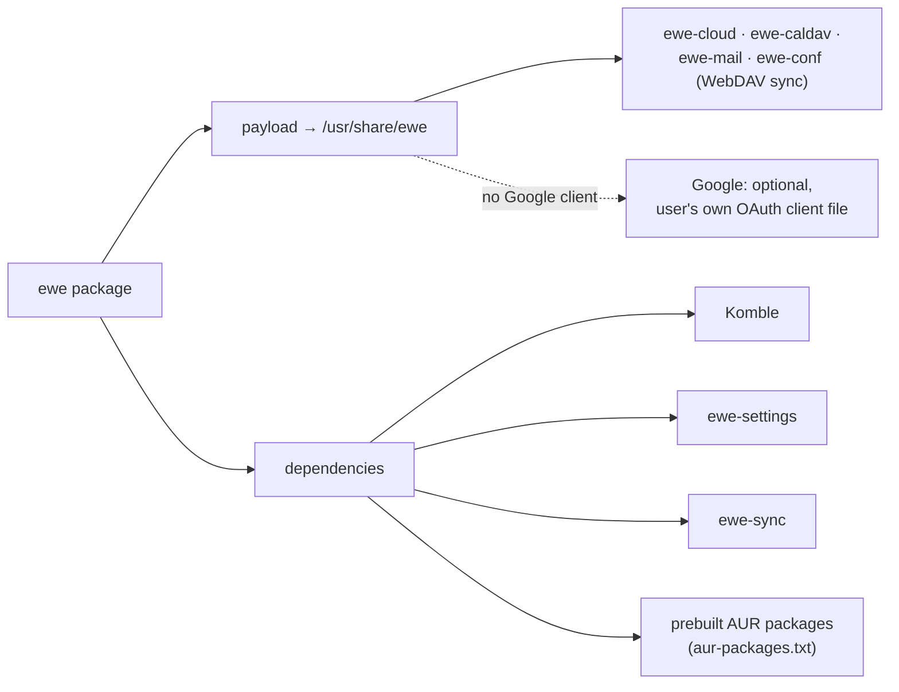

---
tags:
  - ewe-map
  - component
title: ewe-repo
up: "[[Home]]"
---

# ewe-repo — the pacman repository

`~/Projects/ewe/ewe-repo` · [github.com/prj786/ewe-repo](https://github.com/prj786/ewe-repo)

The pacman repository for the ewe desktop. The rolling **x86_64** release of
this repo *is* the repository: `ewe.db` plus every package, rebuilt by the
`publish` workflow and hosted as a GitHub release.

## Use it

```ini
[ewe]
SigLevel = Optional TrustAll
Server = https://github.com/prj786/ewe-repo/releases/download/x86_64
```

(`ewe`'s `install.sh` appends this to `/etc/pacman.conf` for you.)

```sh
sudo pacman -Syu        # updates the DE like any other package
sudo pacman -S ewe      # or: pull the whole desktop onto a fresh Arch install
```

## What `pacman -S ewe` pulls



## Publish

The `publish` workflow rebuilds everything from the latest releases and AUR
PKGBUILDs and recreates the x86_64 release. Triggers:

- manual `workflow_dispatch`
- a `repository_dispatch` of type `publish`
- the **Monday cron**

Run it after any ewe / komble-arch / ewe-settings / ewe-sync release.

## Known state

- Packages are currently **unsigned** (`SigLevel = Optional TrustAll`);
  repo signing is planned before the standalone-distro release.
- `pkgbuilds/` holds the package recipes; the `aur-packages.txt` list names
  the AUR packages that get prebuilt so users never build them.

## Related

- [[Packaging and Updates]] · [[Update Flow]] · [[Komble]] ·
  [[ewe-os ISO]]
