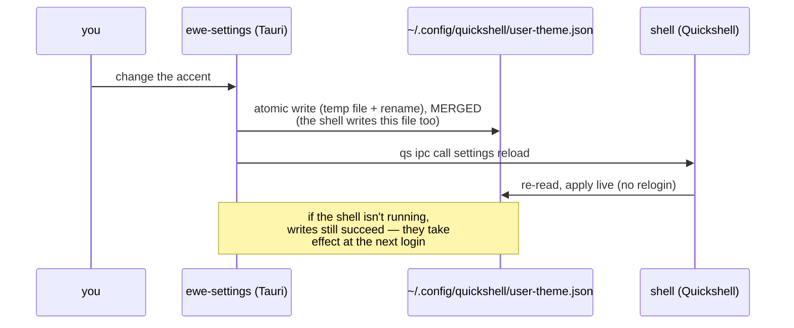

---
tags:
  - ewe-map
  - component
title: ewe-settings
up: "[[Home]]"
---

# ewe-settings — the Settings app

`~/Projects/ewe/ewe-settings` · [github.com/prj786/ewe-settings](https://github.com/prj786/ewe-settings) ·
Tauri v2 + Svelte 5 · formerly `hypr-shell-settings` (the package
`provides`/`replaces` the old name and ships a `hypr-settings` symlink)

## Why it is a separate process

The shell itself is Quickshell/QML, and everything that has to be a
Wayland **layer-shell** surface — bar, dock, notifications, OSD, lock —
stays there, because Tauri cannot create layer-shell surfaces at all.

Settings is the one piece that does not need to be a layer surface: it is an
ordinary window. Moving it out keeps a large, rarely-open UI out of the
shell process, **where a QML error takes the whole desktop down with it**.

## How it talks to the shell

It does not. It writes the same files the shell already reads, then asks the
shell to re-read them:

That contract has three useful properties: **one source of truth** still
exists, a change **survives a shell restart** for free, and the existing
cloud sync needs no changes — those files are exactly what it already backs
up.

> With [[The One File]] (RFC-001), the UIs persist by writing *through*
> `ewe-conf`; the live-apply path above stays the same.

## Public API

The IPC verbs this app depends on (`reload`, `ping`, `version`) live in
ewe's `Settings.qml`. They are **public API in both directions**: renaming
one breaks an installed binary.

## Privileges

**None.** Every file it touches is already owned by the user, so unlike
Komble there is no polkit helper and no setuid anything.

## Version

The footer shows **ewe's** version, not this app's — Settings is part of the
desktop rather than a product with its own release line.

## Related

- [[Desktop Shell]] · [[The One File]] · [[Settings Flow]] ·
  [[System Architecture]]

> **Build guard:** ewe-settings stays an ordinary window in its own
> process, writes atomically and merges, needs no privileges, and never
> renames the `reload`/`ping`/`version` verbs. Rationale:
> [[Process Split — Shell vs Apps]] and [[Contracts and Public API]].
