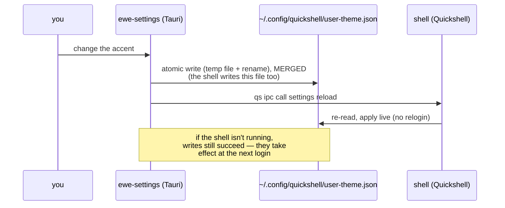

---
tags:
  - ewe-map
  - component
title: ewe-settings
up: "[[Home]]"
---

# ewe-settings — the Settings app

`~/Projects/ewe/ewe-settings` · [github.com/prj786/ewe-settings](https://github.com/prj786/ewe-settings) ·
Tauri v2 + Svelte 5 · formerly `hypr-shell-settings` (the package
`provides`/`replaces` the old name and ships a `hypr-settings` symlink)

## Why it is a separate process

The shell itself is Quickshell/QML, and everything that has to be a
Wayland **layer-shell** surface — bar, dock, notifications, OSD, lock —
stays there, because Tauri cannot create layer-shell surfaces at all.

Settings is the one piece that does not need to be a layer surface: it is an
ordinary window. Moving it out keeps a large, rarely-open UI out of the
shell process, **where a QML error takes the whole desktop down with it**.

## How it talks to the shell

It does not. It writes the same files the shell already reads, then asks the
shell to re-read them:

```mermaid
sequenceDiagram
    participant U as you
    participant S as ewe-settings (Tauri)
    participant F as ~/.config/quickshell/user-theme.json
    participant SH as shell (Quickshell)

    U->>S: change the accent
    S->>F: atomic write (temp file + rename), MERGED<br/>(the shell writes this file too)
    S->>SH: qs ipc call settings reload
    SH->>F: re-read, apply live (no relogin)
    Note over S,F: if the shell isn't running,<br/>writes still succeed — they take<br/>effect at the next login
```

That contract has three useful properties: **one source of truth** still
exists, a change **survives a shell restart** for free, and the existing
cloud sync needs no changes — those files are exactly what it already backs
up.

> With [[The One File]] (RFC-001), the UIs persist by writing *through*
> `ewe-conf`; the live-apply path above stays the same.

## Public API

The IPC verbs this app depends on (`reload`, `ping`, `version`) live in
ewe's `Settings.qml`. They are **public API in both directions**: renaming
one breaks an installed binary.

## Add-on awareness (0.25, branch `feat/addons`)

Settings edits prefs that add-ons read, so it has to know which are there:

- Backend `addons_state` — a cached `ewe-plugin list --json` (5 s cache;
  **legacy fallback**: no `available` key = an older ewe = everything
  counts as installed) and `open_addons` → `komble --addons`.
- **Layout → Dock** shows a note + "Get add-ons" when `ewe.dock` is absent;
  **Account → Mail** notes the `ewe.mail` add-on and **stops polling** the
  `mail` target when it is missing; **Layout → Top bar** lists plugin bar
  widgets as `plugin:<id>` rows (setPrefs → `write_prefs` → ewe-conf absorbs
  into user-theme); **System → Add-ons** group: "Browse add-ons".
- `qs_ipc`: a missing add-on target is **never an error**
  (`ADDON_TARGETS = ["mail"]`); `google` and `cloud` stay core targets.
- Screensaver pane says **Insomnia** (D5, commit 265b0cc).
- `hypr.js` emits a **guarded** `after_sleep_cmd` (no unconditional dpms-on
  — [[Quiet Lid — touch only a disabled panel]], commit 2e9c698).
- Dev mocks live inline in `dev-mock.html` (`?addons=fresh|dock|legacy`,
  `?komble=0`); `.dev-mock/` is local-only (`.git/info/exclude`).
- Depends on the public contract: `komble --addons`, and `list --json`
  fields `available` / `removed` / `plugins[].kinds`
  ([[Contracts and Public API]]).

## Privileges

**None.** Every file it touches is already owned by the user, so unlike
Komble there is no polkit helper and no setuid anything.

## Version

The footer shows **ewe's** version, not this app's — Settings is part of the
desktop rather than a product with its own release line.

## Related

- [[Desktop Shell]] · [[The One File]] · [[Settings Flow]] ·
  [[System Architecture]]

> **Build guard:** ewe-settings stays an ordinary window in its own
> process, writes atomically and merges, needs no privileges, and never
> renames the `reload`/`ping`/`version` verbs. A missing add-on IPC target
> is never an error; `google`/`cloud` stay core. Rationale:
> [[Process Split — Shell vs Apps]] and [[Contracts and Public API]].
