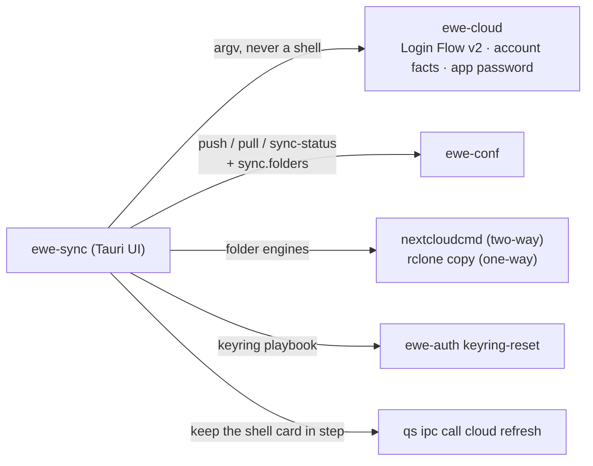

---
tags:
  - ewe-map
  - component
title: ewe-sync
up: "[[Home]]"
---

# ewe-sync — the account & sync app

`~/Projects/ewe/ewe-sync` · [github.com/prj786/ewe-sync](https://github.com/prj786/ewe-sync) ·
Tauri v2 + Svelte 5 · RFC-006 (drafted under the working name **Flock**)

**Your ewe account, in one place** — the Nextcloud account, the one file
(`ewe.conf`), the machines that share it, and the folders that sync with it.
A tray icon shows the state; the window is four panes.

**Division of labour:** Komble installs apps and records them in the one
file; ewe-settings edits the one file; **ewe-sync moves the one file and
your folders between your machines**. Nothing else in ewe has a sync button.

## The panes

| pane | what |
|---|---|
| Account | sign in to *your* Nextcloud (any provider, or your own server) through the server's own login page; who you are, storage; sign out; links to provider signup pages |
| Mail | any IMAP mailbox — add, change, remove, check unread. Password → keyring; only host/user/port reach `ewe.conf` |
| Google | the optional extra: where your own `oauth-client.json` goes, connect/disconnect, Gmail + Drive state. ewe ships no Google client |
| This machine | the one file: backup saved by which machine and when, last sync, auto-sync switch, Sync now / Back up / Restore |
| Machines | every machine that backed up to the account, with its ewe version and app count |
| Folders | which folders sync where: two-way (Nextcloud engine) or one-way copies; on change / on a timer / at login; conflicts resolved in place |

Tray: state icon (idle · syncing · conflict · offline · signed out), menu
with Sync now · Pause auto-sync · Open ewe-sync · Quit.

## How it works — a thin UI over the ewe tools

Nothing needs root; there is no privileged helper. Storage layout and
conflict rules: [[Account and Sync]].

## What it cannot do

**Create accounts.** Nextcloud's user-creation API needs administrator
credentials, and a provider's signup form is theirs. ewe-sync links to
signup pages; you create the account in the browser and sign in here.

## Related

- [[Account and Sync]] · [[The One File]] · [[Sync and Backup Flow]] ·
  [[Auth Broker]] · [[Roadmap and Status]]

> **Build guard:** ewe-sync drives the ewe tools as argv — never through a
> shell; it needs no root; and it cannot (by design) create accounts. The
> whole division of labour: [[RFC-006 — ewe-sync App]].
