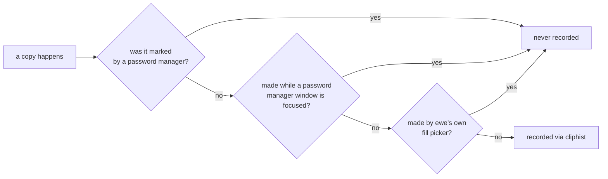

---
tags:
  - ewe-map
  - plugin
title: Clipboard Plugin
up: "[[Home]]"
---

# Clipboard & emoji — `ewe.clipboard`

`~/Projects/ewe/ewe-plugin-clipboard` ·
[github.com/prj786/ewe-plugin-clipboard](https://github.com/prj786/ewe-plugin-clipboard)

First-party, shipped with ewe, removable.

A **scissors icon in the top bar**. Click it: your clipboard history (via
[cliphist](https://github.com/sentriz/cliphist)) and an emoji grid, click to
copy. A service records every text and image copy.

## The password carve-out

Three kinds of copies **never** enter the history:



## Facts

- **One IPC target:** `qs ipc call ewe.clipboard toggle`.
- **Settings** (Komble → Plugins, or CLI): `emoji` — show the emoji tab
  (`ewe-plugin set ewe.clipboard emoji false`).
- **Deps:** `cliphist` and `wl-clipboard` (both ewe dependencies).
- **Remove / re-add:**
  ```sh
  ewe-plugin remove ewe.clipboard
  ewe-plugin add https://github.com/prj786/ewe-plugin-clipboard.git --enable
  ```

## Related

- [[Plugin System]] · [[Passwords Plugin]] · [[CLI Tools]]
