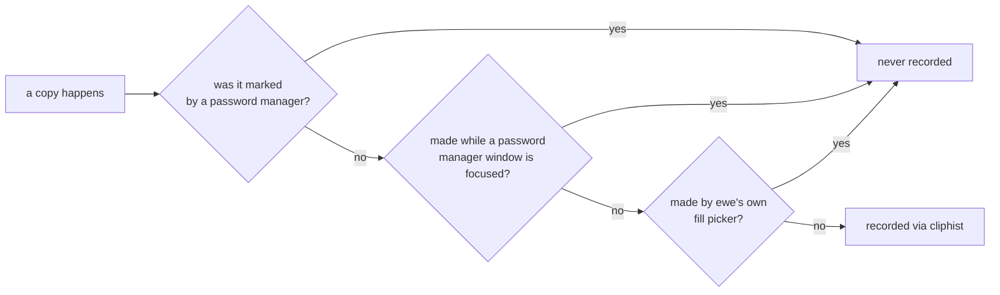

---
tags:
  - ewe-map
  - plugin
title: Clipboard Plugin
up: "[[Home]]"
---

# Clipboard & emoji — `ewe.clipboard`

`~/Projects/ewe/ewe-plugin-clipboard` ·
[github.com/prj786/ewe-plugin-clipboard](https://github.com/prj786/ewe-plugin-clipboard)

First-party **add-on since 0.25** (API 2 manifest, v1.1.1 in
`plugins/bundle.json`): shipped inside the payload, **not installed on a
fresh machine**, migrated once for upgraders who had it. Before 0.25 it was
seeded on every install.

A **scissors icon in the top bar**. Click it: your clipboard history (via
[cliphist](https://github.com/sentriz/cliphist)) and an emoji grid, click to
copy. A service records every text and image copy.

## The password carve-out

Three kinds of copies **never** enter the history:


```mermaid
flowchart LR
    COPY["a copy happens"] --> MARK{"was it marked<br/>by a password manager?"}
    MARK -->|yes| SKIP["never recorded"]
    MARK -->|no| FOCUS{"made while a password<br/>manager window is focused?"}
    FOCUS -->|yes| SKIP
    FOCUS -->|no| OWN{"made by ewe's own<br/>fill picker?"}
    OWN -->|yes| SKIP
    OWN -->|no| HIST["recorded via cliphist"]
```

## Facts

- **One IPC target:** `qs ipc call ewe.clipboard toggle`.
- **Settings** (Komble → Plugins, or CLI): `emoji` — show the emoji tab
  (`ewe-plugin set ewe.clipboard emoji false`).
- **Deps:** `cliphist` and `wl-clipboard` (both ewe dependencies).
- **Install / remove / re-add:**
  ```sh
  ewe-plugin install ewe.clipboard      # or Komble → Add-ons
  ewe-plugin remove ewe.clipboard       # remembered in [plugins].removed
  ewe-plugin install ewe.clipboard      # forgets the removal, back from the payload
  ```
  (The pre-0.25 advice `ewe-plugin add https://github.com/prj786/ewe-plugin-clipboard.git`
  **failed** for a reserved `ewe.` id; since 0.25 `add` of a first-party
  URL is an alias for `install`.)

## Related

- [[Plugin System]] · [[Passwords Plugin]] · [[CLI Tools]]
