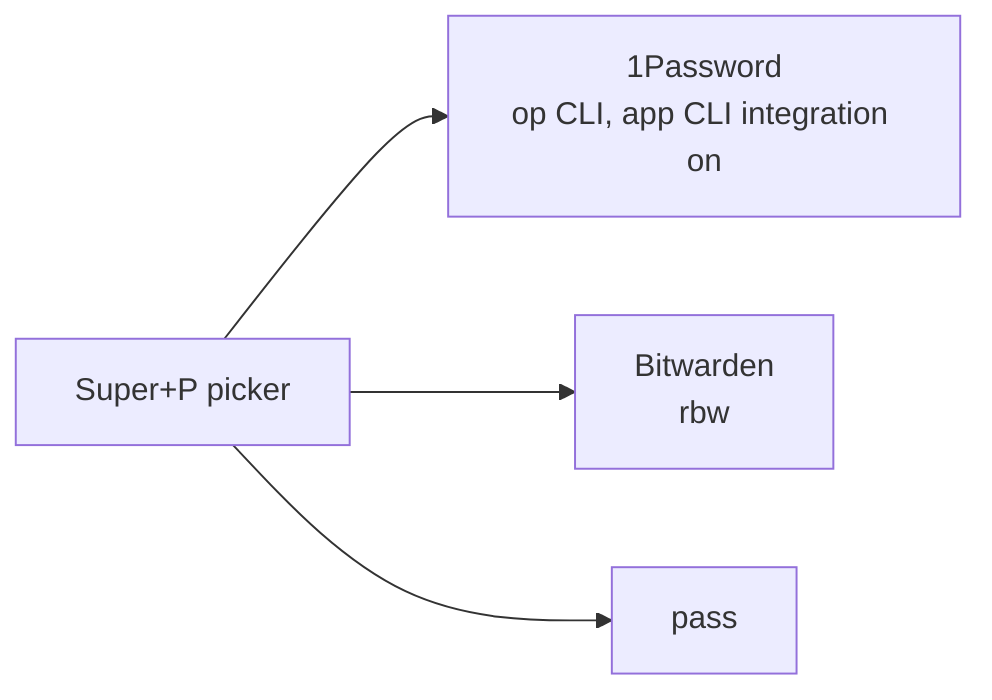

---
tags:
  - ewe-map
  - plugin
title: Passwords Plugin
up: "[[Home]]"
---

# Passwords — `ewe.passwords`

`~/Projects/ewe/ewe-plugin-passwords` ·
[github.com/prj786/ewe-plugin-passwords](https://github.com/prj786/ewe-plugin-passwords)

First-party, shipped with ewe, removable.

`Super+P` in any window lists the logins that match the **focused app** and
types the one you pick — username, Tab, password — through a virtual
keyboard (`wtype`), since no password manager fills into native apps on
Linux.

## Keys in the picker

| key | action |
|---|---|
| `Enter` | type username + Tab + password |
| `Ctrl+Enter` | type the password only |
| `Ctrl+C` / `Ctrl+Shift+C` | copy |
| `Ctrl+P` | pin a login to the current app |

## Providers



- **Settings:** `provider` (auto / 1password / bitwarden / pass),
  `press_enter`.
- **Deps:** `wtype` (an ewe dependency).
- `ewe-pass` in the repo is the tool the panel runs;
  `./ewe-pass status` says what it will do and why not.

Remove / re-add:

```sh
ewe-plugin remove ewe.passwords
ewe-plugin add https://github.com/prj786/ewe-plugin-passwords.git --enable
```

## Related

- [[Plugin System]] · [[Clipboard Plugin]] · [[CLI Tools]]
