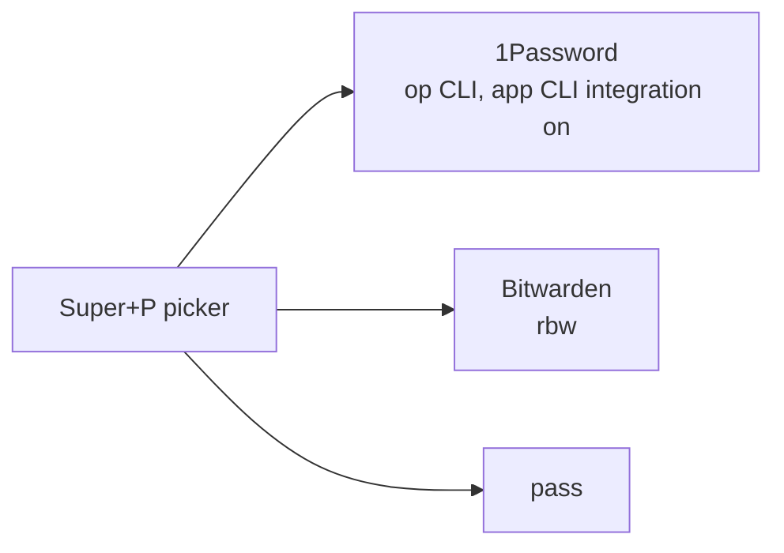

---
tags:
  - ewe-map
  - plugin
title: Passwords Plugin
up: "[[Home]]"
---

# Passwords — `ewe.passwords`

`~/Projects/ewe/ewe-plugin-passwords` ·
[github.com/prj786/ewe-plugin-passwords](https://github.com/prj786/ewe-plugin-passwords)

First-party **plugin since 0.25** (API 2 manifest, v1.1.0): shipped inside
the payload, **not installed on a fresh machine**, migrated once for
upgraders who had it.

`Super+P` in any window lists the logins that match the **focused app** and
types the one you pick — username, Tab, password — through a virtual
keyboard (`wtype`), since no password manager fills into native apps on
Linux.

## Keys in the picker

| key | action |
|---|---|
| `Enter` | type username + Tab + password |
| `Ctrl+Enter` | type the password only |
| `Ctrl+C` / `Ctrl+Shift+C` | copy |
| `Ctrl+P` | pin a login to the current app |

## Providers


```mermaid
flowchart LR
    PANEL["Super+P picker"] --> OP["1Password<br/>op CLI, app CLI integration on"]
    PANEL --> BW["Bitwarden<br/>rbw"]
    PANEL --> PASS["pass"]
```

- **Settings:** `provider` (auto / 1password / bitwarden / pass),
  `press_enter`.
- **Deps:** `wtype` (an ewe dependency).
- `ewe-pass` in the repo is the tool the panel runs;
  `./ewe-pass status` says what it will do and why not.

Install / remove / re-add (Komble → Plugins, or):

```sh
ewe-plugin install ewe.passwords
ewe-plugin remove ewe.passwords
ewe-plugin install ewe.passwords      # not `add <url>` — that failed for a reserved id before 0.25
```

`Super+P` exists only while the plugin is enabled
(`generated/plugin-keybinds.lua`).

## Related

- [[Plugin System]] · [[Clipboard Plugin]] · [[CLI Tools]]
