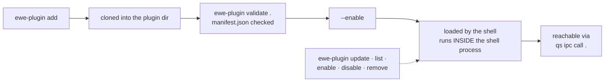

---
tags:
  - ewe-map
  - plugin
title: Plugin System
up: "[[Home]]"
---

# The ewe plugin system

`ewe-plugin add <git-url>` drops third-party bar widgets, panels and
services into the shell. Three first-party plugins ship with ewe and are
removable: [[Clipboard Plugin]], [[Screenshot Plugin]], [[Passwords Plugin]].
The reference implementation to copy is [[Example Plugin]].

## Lifecycle

## The three entry points (one file each)

| kind | file | what it is |
|---|---|---|
| `service` | `Service.qml` | a headless object — no UI, does work (e.g. logs the shell version and accent via `Globals` and `Theme`) |
| `panel` | `Panel.qml` | a `PanelWindow` with its own `IpcHandler` — a full window/panel |
| `bar-widget` | `Widget.qml` | an `Item` the top bar packs like a built-in indicator; click opens Settings |
| `desktop-widget` | `Widget.qml` | a sized `Item` on the desktop or sticky layer, moved in arrange mode |

## The full `ewe-plugin` verb roster

| verb | what it does |
|---|---|
| `add <git-url \| dir> [--enable] [--yes]` | clone (or copy a plain dir), validate, record the source — never runs code |
| `list [--json]` | every plugin: on/off, version, kinds; flags enabled-but-not-installed |
| `info <id> [--json]` | one plugin's manifest and state |
| `enable <id>` / `disable <id>` | flip `[plugins].enabled` in ewe.conf, restart the shell (`--no-restart` defers) |
| `update [id] [--yes]` | fast-forward git plugins; diff shown first; a manifest that stops validating is rolled back |
| `remove <id> [--yes]` | delete a git clone; hand-made dirs moved to `<id>.bak.<stamp>`; forgets it in ewe.conf |
| `restore [--yes]` | clone every plugin ewe.conf knows that's missing here — the plugin half of Komble's "For you" (never automatic) |
| `validate <dir> [--first-party]` | check manifest + entry points; exit 1 lists every problem |
| `seed <payload-plugins-dir> [--restore <id>] [--no-restart]` | copy the package's bundled plugins in (run by `ewe-setup`); skips removed/linked, refreshes on version change |
| `path` | the plugins directory |
| `create <ns.name> [--name T] [--kinds a,b] [--section right] [--dir P]` | a new plugin repo: manifest, one working QML per kind, README, MIT licence, `git init` + first commit |
| `dev [dir]` | link a working copy in (edits live after a restart), enable, restart the shell, follow its log |
| `place <id> [--x --y] [--layer desktop\|top] [--visible on\|off] [--output NAME] [--reset]` | where a desktop widget sits — live, no restart |
| `set <id> <key> <value>` / `get <id> [key]` | a plugin's declared settings (typed by its manifest) — live |

Enabling/disabling restarts `ewe.service` — no QML hot reload; a one-second
restart is honest about that. The shell's own apps survive (`KillMode=process`).

## The manifest

- `id` is `<your-namespace>.<name>` — lowercase, `ewe.` is reserved.
- The manifest fields, the kinds, what the shell exposes as **public API**
  and the **safe-mode** rules are documented in ewe's
  [`docs/PLUGINS.md`](https://github.com/prj786/ewe/blob/main/docs/PLUGINS.md).

## The honesty rule

> Plugins run **unsandboxed inside the shell process**. Keep yours small and
> honest, and so will everyone who reads it before enabling it.

A misbehaving plugin can take the desktop down — the same reason the big
UIs were moved out (see [[ewe-settings]]).

## Settings

Plugins can expose settings through Komble → Plugins, or
`ewe-plugin set <id> <key> <value>` (e.g.
`ewe-plugin set ewe.clipboard emoji false`).

## Related

- [[Desktop Shell]] · [[CLI Tools]] · [[Example Plugin]] ·
  [[System Architecture]]

> **Build guard:** plugins run unsandboxed inside the shell — never
> promise sandboxing or install hooks; keep the public QML surface behind
> `apiVersion`; reject entry-point symlinks that resolve outside the
> plugin dir. Rationale: [[Plugins Unsandboxed]] and
> [[Plugin Manifest Reference]].
