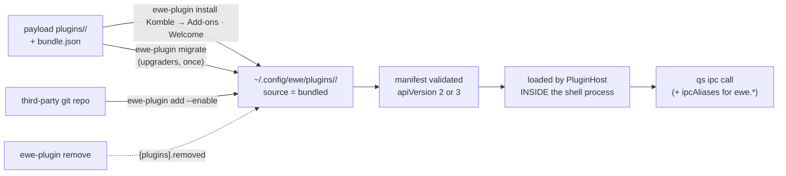

---
tags:
  - ewe-map
  - plugin
title: Plugin System
up: "[[Home]]"
---

# The ewe plugin system (API 3, add-ons model — 0.25)

ewe's desktop is one long-lived Quickshell process. A **plugin** is a
directory of QML it loads at startup exactly as it loads its own bar and
panels. Plugins add Quick settings tiles and pages, glyphs to the bar's
Quick settings pill, dock items, bar widgets, desktop widgets, their own
panels and headless services — using the same `Theme` roles and the same
public components the first-party surfaces use.

**Plugins are not apps.** *Komble installs programs; `ewe-plugin` extends
the desktop.* Since 0.25 ewe's own extras are plugins too — the
**add-ons**. Source of truth: `ewe/docs/PLUGINS.md` (release branch
`release/0.25.0-beta`).

## Add-ons — what ewe ships, and why it is not pre-installed

Preinstalled is the shell core (bar, launcher, Overview, the Quick settings
basics, notifications, lock, OSD, polkit, Welcome), ewe-settings, Komble
and ewe-sync ([[Add-ons — opt-in, not preinstalled]]). Everything else is
an **add-on**: a first-party plugin that

- **ships inside the ewe payload** — `plugins/<id>/`, vendored from
  `prj786/ewe-plugin-<name>` by `scripts/vendor-plugins.sh`, which records
  repo, commit and version in `plugins/bundle.json`
  ([[Add-ons — vendored payload and bundle.json]]);
- is **not installed on a fresh machine** — Komble → Add-ons, the Welcome
  screen's Add-ons step and `ewe-plugin install <id>` put one in;
- is **kept for upgraders** by `ewe-plugin migrate`, once
  ([[Add-ons — one-time migration for upgraders]]).

| id | note | kinds | legacy IPC / key kept |
|---|---|---|---|
| `ewe.clipboard` | [[Clipboard Plugin]] | bar-widget, panel, service | — |
| `ewe.screenshot` | [[Screenshot Plugin]] | bar-widget, panel | — |
| `ewe.passwords` | [[Passwords Plugin]] | panel | — |
| `ewe.insomnia` | [[Insomnia Plugin]] | service, quick-tile, bar-status | namespace `quickshell:caffeine` |
| `ewe.sysmon` | [[System Monitor Plugin]] | quick-tile (span 2), bar-widget | — |
| `ewe.ssh` | [[SSH Plugin]] | quick-tile, quick-page `ssh`, bar-status | `quicksettings tab ssh` |
| `ewe.vpn` | [[VPN Plugin]] | quick-tile, quick-page `vpn`, bar-status | `quicksettings tab vpn` |
| `ewe.media` | [[Music Plugin]] | panel, dock-item, bar-widget | `player` |
| `ewe.places` | [[Places Plugin]] | panel, dock-item, bar-widget | `places` |
| `ewe.phone` | [[Phone Plugin]] | service, quick-page `mobile`, bar-status | `quicksettings tab mobile` |
| `ewe.mail` | [[Mail Plugin]] | service, quick-page `mail`, bar-status | `mail` |
| `ewe.cast` | [[Cast Plugin]] | service, quick-tile, quick-page `cast`, bar-status, keybind | `cast` |
| `ewe.dock` | [[Dock Plugin]] | panel (own PanelWindows, hosts dock-items) | `launcher` |

Once installed an add-on is an ordinary plugin with source `bundled`:
`list` shows it, `set` changes its settings, `disable` hides it, `remove`
deletes it and remembers that in `[plugins].removed` so a later upgrade
leaves it out — `install <id>` (or `seed --restore <id>`) brings it back.
A newer ewe refreshes an installed bundled copy when its version changes
(never one linked with `dev`). **Komble is the one-click installer**: its
Add-ons catalogue reads `ewe-plugin list --json` → `available[]`, installs
missing packages first ([[Add-on deps declared, not split]]), then runs
`ewe-plugin install`.

## Lifecycle


```mermaid
flowchart LR
    PAY["payload plugins/<id>/<br/>+ bundle.json"] -->|"ewe-plugin install <id><br/>Komble → Add-ons · Welcome"| INST["~/.config/ewe/plugins/<id>/<br/>source = bundled"]
    PAY -->|"ewe-plugin migrate<br/>(upgraders, once)"| INST
    GIT["third-party git repo"] -->|"ewe-plugin add <url> --enable"| INST
    INST --> VALID["manifest validated<br/>apiVersion 2 or 3"]
    VALID --> RUN["loaded by PluginHost<br/>INSIDE the shell process"]
    RUN --> IPC["qs ipc call <id> <verb><br/>(+ ipcAliases for ewe.*)"]
    RM["ewe-plugin remove"] -.->|"[plugins].removed"| INST
```

## The kinds (API 3)

| kind | what the shell does with it | injected |
|---|---|---|
| `service` | instantiated headless, once — timers, processes, D-Bus, an `IpcHandler` | the common set |
| `panel`, `overlay`, `menu` | instantiated once; the plugin owns its `PanelWindow`s (or an `AnchoredPopup`) and `IpcHandler`s | the common set |
| `bar-widget` | an `Item` with implicit size, packed into its bar section, once per monitor | + `screen`, `barWindow` |
| `bar-status` | a glyph **inside the Quick settings pill**, after the shell's own, once per monitor — root on `BarStatusGlyph`, set `shown` (not `visible`) | + `screen`, `barWindow`, `ink` |
| `quick-tile` | a `Tile` in the Quick settings home grid after the built-ins; the host sizes it (`span` 1 or 2) | + `panelOpen` |
| `quick-page` | a `Column` the width of the panel + one rail entry; shown while its `key` is the tab; start with `QsPageHead` | + `panelOpen` |
| `desktop-widget` | a sized `Item` on the desktop or sticky layer, moved in arrange mode | the common set |
| `dock-item` | **no QML** — the dock draws a button from `dockItem` and runs `Shell.runAction(action, anchor)`; lit while `Shell.isActive(action)`; hidden while `Shell.dockItemShown(id)` is false. No dock installed → no host, no error | — |

Common set: `pluginId`, `pluginDir`, `stateDir`
(`~/.local/state/ewe/plugins/<id>/`, created on demand, never synced),
`settings` (live). `panelOpen` means **this** tile/page is on screen — poll
only while true. Fields, rules and the `Shell` singleton: [[Plugin Manifest Reference]]
and [[Plugin API 3]].

## The full `ewe-plugin` verb roster

| verb | what it does |
|---|---|
| `add <git-url \| dir \| id> [--enable] [--yes] [--no-restart]` | clone (or copy a plain dir), validate, record the source — never runs code. A **first-party URL or reserved id that exists in the payload installs the payload's copy** instead of refusing |
| `list [--json]` | every plugin: on/off, version, kinds; `--json` adds `available[]` (id, name, description, icon, category, version, kinds, installed, enabled, default, migrate, repo, requires, `missing{packages,commands}`) and `removed[]` |
| `info <id> [--json]` | one plugin's manifest and state |
| **`install <id> [--no-restart]`** | an add-on out of the payload: copied in with source `bundled`, removal forgotten, enabled, keybinds regenerated. One JSON object (`ok`, `version`, `missing`, `restarted`); unknown id → `ok: false`, exit 1 |
| **`migrate [--no-restart] [--fresh]`** | the one-time add-on migration (D3). JSON: `migrated`, `skipped` (with `why`), `fresh` |
| `enable <id>` / `disable <id>` | flip `[plugins].enabled` in ewe.conf, restart the shell (`--no-restart` defers) |
| `update [id] [--yes]` | fast-forward git plugins; diff shown first; a manifest that stops validating is rolled back |
| `remove <id> [--yes]` | delete a git clone or a bundled copy (remembered in `[plugins].removed`); hand-made dirs moved to `<id>.bak.<stamp>`; forgets it in ewe.conf |
| `restore [--yes] [--no-restart]` | install every plugin ewe.conf knows that is missing here — git URLs cloned, bundled add-ons copied from the payload; the plugin half of Komble's "For you" and Welcome (never automatic) |
| `validate <dir> [--first-party] [--json]` | check manifest + entry points; exit 1 lists every problem (`--first-party` allows a reserved `ewe.` id) |
| `seed [dir] [--restore <id>] [--no-restart]` | the payload's `default` plugins in (**none in 0.25**), installed bundled copies refreshed (run by `ewe-setup` and phase 60); `--restore <id>` forgets a removal and installs that id |
| `path` | the plugins directory |
| `create <ns.name> [--name T] [--kinds a,b] [--section right] [--dir P]` | a new plugin repo: manifest, one working QML per kind, README, MIT licence, `git init` + first commit |
| `dev [dir] [--no-restart] [--no-follow]` | link a working copy in, enable, restart the shell, follow its log |
| `place <id> [--x --y] [--layer desktop\|top] [--visible on\|off] [--output NAME] [--reset]` | where a desktop widget sits — live |
| `set <id> <key> <value>` / `get <id> [key]` | a plugin's declared settings (typed by its manifest) — live |

Enabling/disabling restarts `ewe.service` — no QML hot reload. Every verb
that takes `--no-restart` leaves the host's `ewe.service` alone; use it
from scripts, tests and the nested harness. **Gotcha:** even with
`--no-restart`, `install`/`enable` run `hyprctl reload` (the keybind
writer) and `set`/`place` poke `plugins reload` — against whatever
`HYPRLAND_INSTANCE_SIGNATURE` / `WAYLAND_DISPLAY` say. From a harness, run
the tool with both **unset** (the driver does: `env -u
HYPRLAND_INSTANCE_SIGNATURE -u WAYLAND_DISPLAY`). See [[Troubleshooting Knowledge]].

## Environment knobs

`EWE_PAYLOAD_PLUGINS` (the payload dir the tool reads), `EWE_PLUGIN_SRC_DIR`
(`vendor-plugins.sh` source), harness: `HS_PLUGINS=1` (install every
payload add-on into the sandbox), `HS_PAYLOAD=<dir>` (which payload),
`HS_PLUGIN_DIRS=a:b` (extra plugin dirs — fixtures; refuses `ewe.*` ids),
`HS_PRIVATE_BUS=1` (own session D-Bus — needed for the phone add-on).

## Writing one

```sh
ewe-plugin create acme.weather --name "Weather" --kinds quick-tile,quick-page,bar-status
cd acme.weather && ewe-plugin dev .
```

You own the QML. ewe owns where it lives and what the user may change
(tile place, rail entry, bar section/visibility, widget placement,
`settings` values — all in `ewe.conf`, moved in arrange mode
`Super+Shift+W`, edited as a form in Komble). The worked examples:
[[Example Plugin]] (API 2), `tests/fixtures/plugins/acme.v3demo` (every API
3 kind in four files) and every add-on repo above.

## The honesty rule

> Plugins run **unsandboxed inside the shell process**. Keep yours small and
> honest, and so will everyone who reads it before enabling it.

Installing never runs plugin code — `add` clones and validates, `install`
copies out of the payload; the code runs when enabled. A misbehaving
plugin can take the desktop down ([[Plugins Unsandboxed]]); **safe mode**
boots the third crash-following start inside a minute with no plugins.

## Related

- [[Plugin Manifest Reference]] · [[Plugin API 3]] · [[Desktop Shell]] ·
  [[CLI Tools]] · [[Komble]] · [[IPC Verb Reference]]

> **Build guard:** plugins run unsandboxed — never promise sandboxing or
> install hooks; keep the public QML surface (`Shell`, the components,
> `Theme`, the `Globals` API 2 subset) behind `apiVersion`; reject
> entry-point symlinks outside the plugin dir; an add-on keeps its legacy
> IPC target (`ipcAliases`), layer namespace and quick-page key — Rule 4.
> Re-adding a removed add-on is `ewe-plugin install <id>` (or Komble →
> Add-ons), **not** `add <url>` of the GitHub repo (that failed before
> 0.25 and is only an alias for `install` now).
