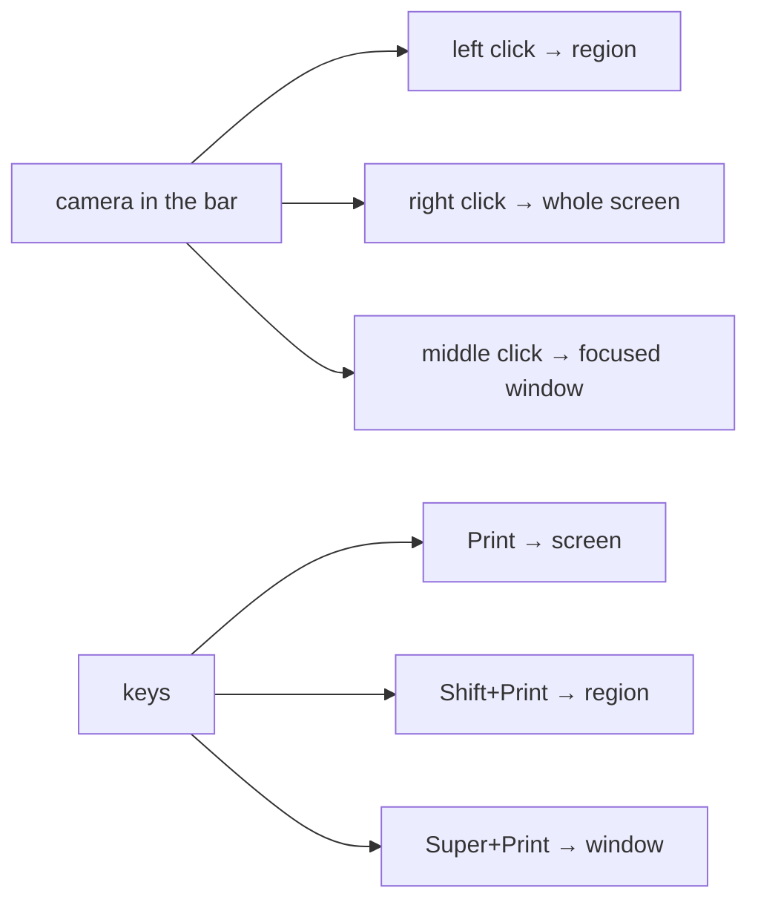

---
tags:
  - ewe-map
  - plugin
title: Screenshot Plugin
up: "[[Home]]"
---

# Screenshot — `ewe.screenshot`

`~/Projects/ewe/ewe-plugin-screenshot` ·
[github.com/prj786/ewe-plugin-screenshot](https://github.com/prj786/ewe-plugin-screenshot)

First-party, shipped with ewe, removable.

A **camera in the top bar**, with three click modes and three keys:



- Shots land in `~/Pictures/Screenshots` and pile into a **preview stack
  bottom-right**: drag it into any app to drop the files, click to copy the
  newest.
- **Setting:** `copy` — also copy each shot to the clipboard (default on).
- **IPC target `ewe.screenshot`:** `shoot full|region|activewindow`,
  `pop <path>`, `dismiss`.
- **Deps:** `grim`, `slurp`, `wl-clipboard` (ewe dependencies).

Remove / re-add:

```sh
ewe-plugin remove ewe.screenshot
ewe-plugin add https://github.com/prj786/ewe-plugin-screenshot.git --enable
```

## Related

- [[Plugin System]] · [[CLI Tools]]
