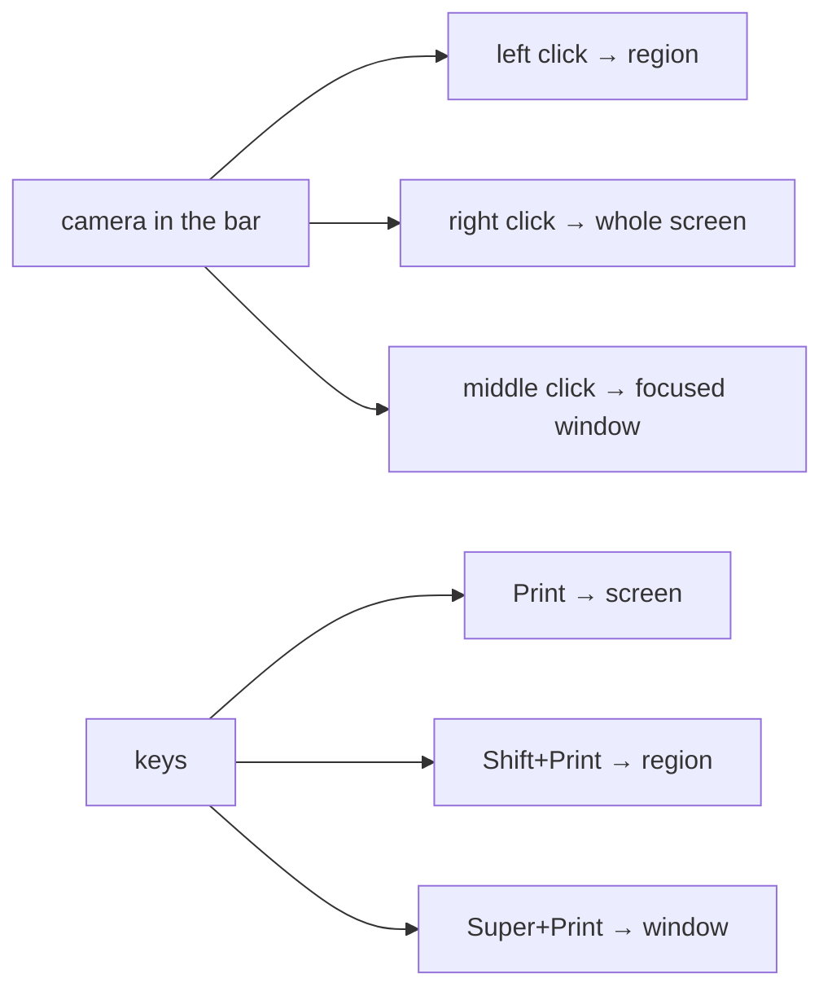

---
tags:
  - ewe-map
  - plugin
title: Screenshot Plugin
up: "[[Home]]"
---

# Screenshot — `ewe.screenshot`

`~/Projects/ewe/ewe-plugin-screenshot` ·
[github.com/prj786/ewe-plugin-screenshot](https://github.com/prj786/ewe-plugin-screenshot)

First-party **add-on since 0.25** (API 2 manifest, v1.1.0): shipped inside
the payload, **not installed on a fresh machine**, migrated once for
upgraders who had it.

A **camera in the top bar**, with three click modes and three keys:


```mermaid
flowchart LR
    CAM["camera in the bar"] --> L["left click → region"]
    CAM --> R["right click → whole screen"]
    CAM --> M["middle click → focused window"]
    KEY["keys"] --> K1["Print → screen"]
    KEY --> K2["Shift+Print → region"]
    KEY --> K3["Super+Print → window"]
```

- Shots land in `~/Pictures/Screenshots` and pile into a **preview stack
  bottom-right**: drag it into any app to drop the files, click to copy the
  newest.
- **Setting:** `copy` — also copy each shot to the clipboard (default on).
- **IPC target `ewe.screenshot`:** `shoot full|region|activewindow`,
  `pop <path>`, `dismiss`.
- **Deps:** `grim`, `slurp`, `wl-clipboard` (ewe dependencies).

Install / remove / re-add (Komble → Add-ons, or):

```sh
ewe-plugin install ewe.screenshot
ewe-plugin remove ewe.screenshot
ewe-plugin install ewe.screenshot     # not `add <url>` — that failed for a reserved id before 0.25
```

The Print keybinds exist only while the add-on is enabled
(`generated/plugin-keybinds.lua`).

## Related

- [[Plugin System]] · [[CLI Tools]]
