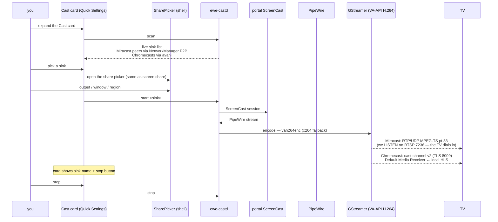

---
tags:
  - ewe-map
  - workflow
title: Cast Flow
up: "[[Home]]"
---

# Cast Flow — mirror the desktop to a TV

The whole flow lives in the Control Centre's **Cast card**. No foreign
window, no gnome-network-displays, no DE it doesn't belong to.

## The two sink paths

| sink | discovery | transport | latency |
|---|---|---|---|
| Miracast (Samsung…) | NetworkManager Wi-Fi P2P D-Bus | hand-rolled WFD RTSP source, port 7236; RTP/UDP MPEG-TS pt 33 | **real-time** |
| Chromecast / Google TV | avahi | cast-channel v2 (protobuf, TLS 8009), Default Media Receiver playing local HLS | seconds — honest; true mirroring is a future milestone |

## Status (2026-08-30)

Phases A+B built; Miracast proven against a **loopback sink**. First
real-TV field test pending.

## Related

- [[ewe-cast]] · [[Desktop Shell]] · [[Roadmap and Status]]
