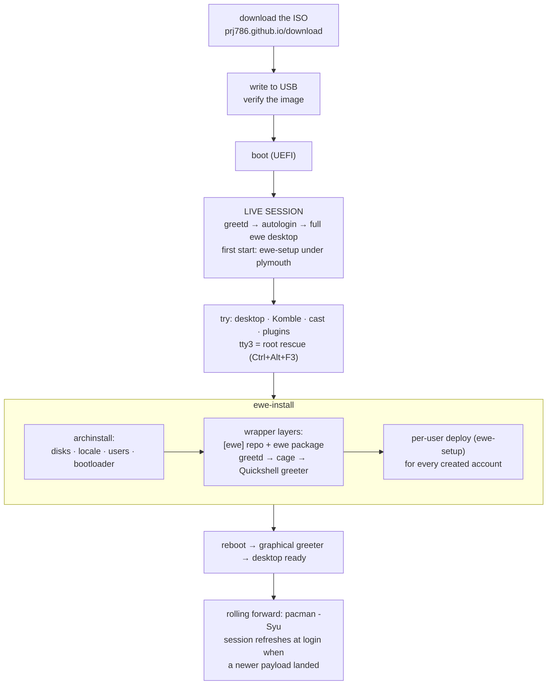

---
tags:
  - ewe-map
  - workflow
title: Install Flow
up: "[[Home]]"
---

# Install Flow — from ISO to desktop

The whole thing takes about ten minutes. The live session *is* the desktop,
so you can try everything before touching a disk.



## The alternative path — DE only

On Arch you already have:

```sh
# /etc/pacman.conf ← [ewe] (see ewe-repo)
sudo pacman -S ewe        # desktop, Komble, ewe-settings + dependencies
ewe-setup                 # per-user deployment
sudo /usr/share/ewe/install.sh   # system: greeter, plymouth, hibernate
```

## The hacker path

```sh
git clone https://github.com/prj786/ewe ~/ewe && cd ~/ewe
bash install.sh           # symlink farm; prompts before each change
./update.sh               # pull + converge + restart the shell
```

Both are idempotent and back up every config they touch; `uninstall.sh`
restores them. Full details: `ewe/docs/MANUAL.md`.

## Related

- [[ewe-os ISO]] · [[Packaging and Updates]] · [[Update Flow]] ·
  [[ewe Desktop]]
