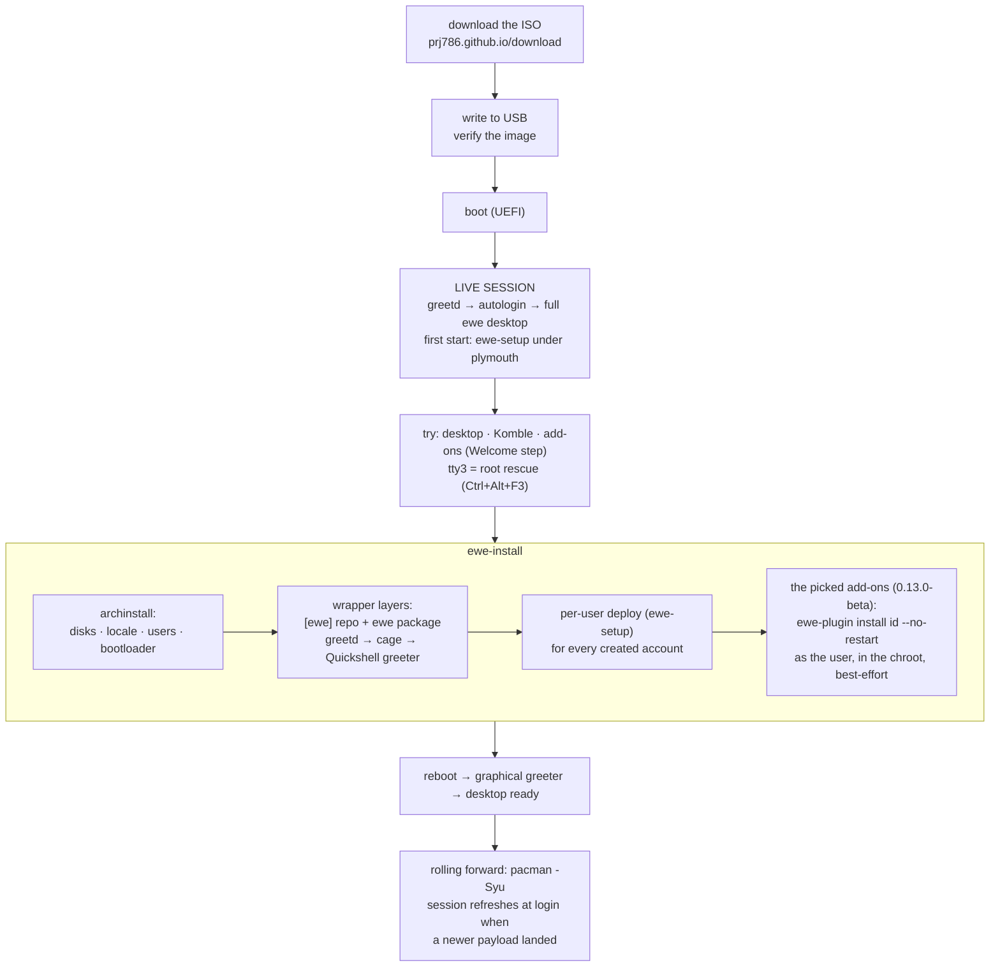

---
tags:
  - ewe-map
  - workflow
title: Install Flow
up: "[[Home]]"
---

# Install Flow — from ISO to desktop

The whole thing takes about ten minutes. The live session *is* the desktop,
so you can try everything before touching a disk.


```mermaid
flowchart TB
    DOWN["download the ISO<br/>prj786.github.io/download"] --> WRITE["write to USB<br/>verify the image"]
    WRITE --> BOOT["boot (UEFI)"]
    BOOT --> LIVE["LIVE SESSION<br/>greetd → autologin → full ewe desktop<br/>first start: ewe-setup under plymouth"]
    LIVE --> TRY["try: desktop · Komble · add-ons (Welcome step)<br/>tty3 = root rescue (Ctrl+Alt+F3)"]
    TRY --> INSTALL["run ewe-installer (or ewe-install)"]

    subgraph INSTALL["ewe-install"]
        A1["archinstall:<br/>disks · locale · users · bootloader"]
        A2["wrapper layers:<br/>[ewe] repo + ewe package<br/>greetd → cage → Quickshell greeter"]
        A3["per-user deploy (ewe-setup)<br/>for every created account"]
        A4["the picked add-ons (0.13.0-beta):<br/>ewe-plugin install id --no-restart<br/>as the user, in the chroot, best-effort"]
        A1 --> A2 --> A3 --> A4
    end

    INSTALL --> REBOOT["reboot → graphical greeter → desktop ready"]
    REBOOT --> FORWARD["rolling forward: pacman -Syu<br/>session refreshes at login when<br/>a newer payload landed"]
```

## The alternative path — DE only

On Arch you already have:

```sh
# /etc/pacman.conf ← [ewe] (see ewe-repo)
sudo pacman -S ewe        # desktop, Komble, ewe-settings + dependencies
ewe-setup                 # per-user deployment (+ ewe-plugin seed / migrate)
bash /usr/share/ewe/install.sh --no-packages   # system: greeter, plymouth, hibernate — AS YOUR USER
```

> **Never `sudo /usr/share/ewe/install.sh`.** The installer refuses (exit 2,
> `install.sh:38-50`): under sudo `$HOME` is `/root`, the desktop would
> install into root's home and the system-wide session entry would point
> at `/root/.config/hypr/start-hyprland.sh` — the greeter then dies
> silently. It escalates by itself (`sudo_run`) exactly where root is needed.

## What a fresh install gets (0.25)

The shell core, ewe-settings, Komble and ewe-sync — **no plugins**: no
dock, no clipboard history, no Cast tile, no mail ([[Add-ons — opt-in, not preinstalled]]).
The **installer's Plugins step** (ewe-os 0.13.0-beta — the live payload's
catalogue, nothing pre-checked, installed for the new account at the end of
the run, each one best-effort), the Welcome screen's **Plugins** step
(nothing pre-checked — *Install selected* / *Browse in Komble*) and Komble →
Plugins put them in. The **live stick** is the exception: its live user gets
`ewe.dock` from `ewe-live-deploy` so *Install ewe* has a dock to sit in. An
**upgrade** keeps what the user had: `ewe-plugin migrate` runs from
`ewe-setup` and from phase 60 when `EWE_PREVIOUS=1` (decided in
`install.sh` before phase 50); a fresh machine runs `migrate --fresh`
([[Add-ons — one-time migration for upgraders]]).

## The hacker path

```sh
git clone https://github.com/prj786/ewe ~/ewe && cd ~/ewe
bash install.sh           # symlink farm; prompts before each change
./update.sh               # pull + converge + restart the shell
```

Both are idempotent and back up every config they touch; `uninstall.sh`
restores them. Full details: `ewe/docs/MANUAL.md`.

## Related

- [[ewe-os ISO]] · [[Packaging and Updates]] · [[Update Flow]] ·
  [[ewe Desktop]] · [[Plugin System]]
