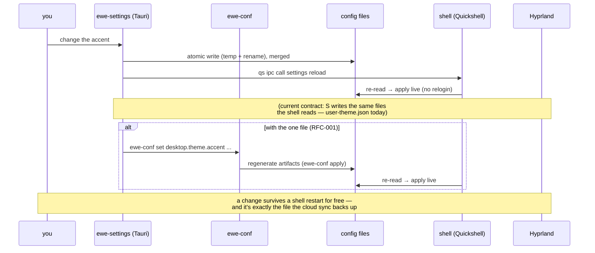

---
tags:
  - ewe-map
  - workflow
title: Settings Flow
up: "[[Home]]"
---

# Settings Flow — how a change travels

Two-layer model: **live-apply** (instant, in-session) + **persist** (through
the file). The UIs apply instantly; the file is the memory.

## The contract's three useful properties

1. **One source of truth** — the file (today: `user-theme.json`; the one
   file under RFC-001). The shell and ewe-settings both merge, never
   replace, because both write.
2. **Restart-proof** — writes succeed even if the shell isn't running; they
   take effect at the next login.
3. **Sync-neutral** — those files are exactly what the cloud sync already
   backs up; no new sync path.

## Who writes what (under RFC-001)

| actor | write path |
|---|---|
| ewe-settings / shell panels / Komble | call `ewe-conf set` — the **only writer** |
| `ewe-conf apply` | regenerates runtime artifacts from the file |
| Hyprland/Quickshell | read artifacts at runtime/login |
| cloud | `ewe-conf push` / `pull` move the file itself |

## Related

- [[ewe-settings]] · [[The One File]] · [[Desktop Shell]] ·
  [[System Architecture]]
