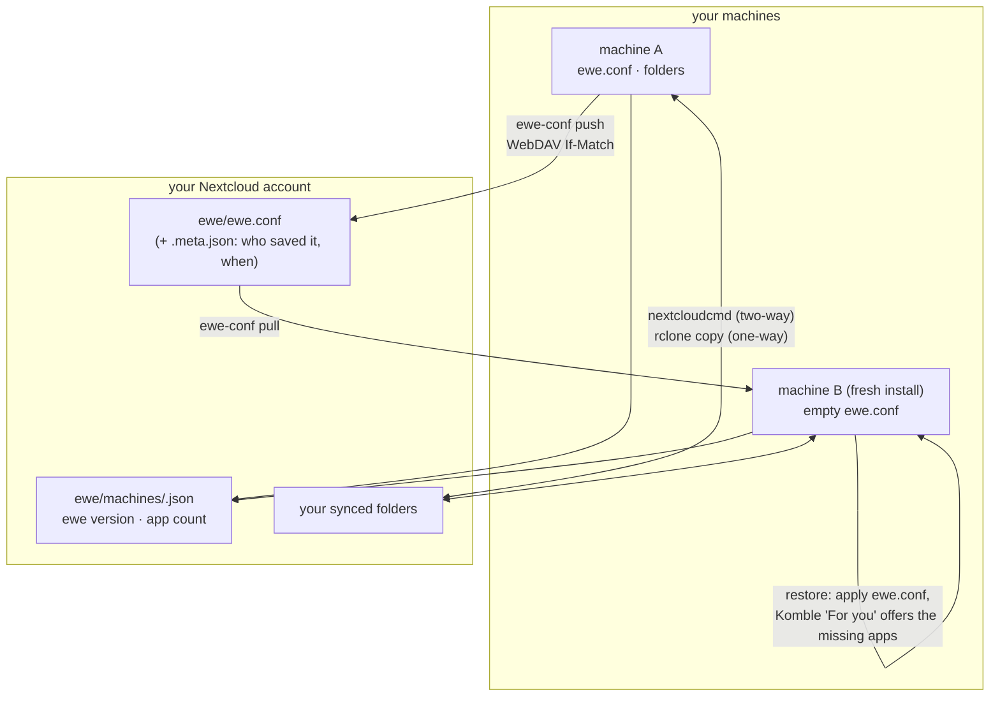

---
tags:
  - ewe-map
  - workflow
title: Sync and Backup Flow
up: "[[Home]]"
---

# Sync & Backup Flow — log in, get your machine back

The promise: **log in, get your machine back.** `ewe.conf` describes the
machine; ewe-sync moves it to your Nextcloud and back. Nothing else in ewe
has a sync button.

## The one-file half

- **Backup** — `ewe-conf push`: WebDAV PUT with `If-Match`. The server
  itself rejects a push that races another machine (412) — no clock or
  hostname guesswork.
- **Restore** — `ewe-conf pull`, then `ewe-conf apply` regenerates the
  runtime files. Installed apps come back through Komble's **For you**,
  which reads `[apps.installed]` from the restored file.

## The folders half

| mode | engine | behaviour |
|---|---|---|
| two-way | `nextcloudcmd` (Nextcloud client's headless engine) | syncs both directions; conflicts in place |
| upload-only / download-only | `rclone copy` | adds and updates, **never deletes** |

Triggers: on change (inotify + 5 quiet seconds) · every N minutes · at
login. Conflicts land as `name (conflicted copy <date>).ext`; *Keep mine* /
*Keep theirs* resolves.

## The machines pane

Every machine that backed up to the account shows up with its ewe version
and app count — the roster of what shares this account.

## Related

- [[Account and Sync]] · [[ewe-sync]] · [[The One File]] · [[Auth Broker]]
