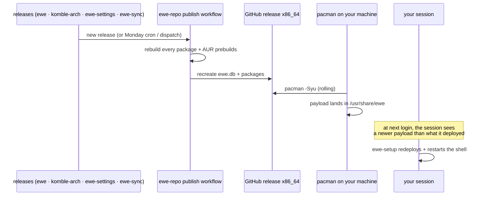

---
tags:
  - ewe-map
  - workflow
title: Update Flow
up: "[[Home]]"
---

# Update Flow — how ewe rolls forward

There is no special updater. ewe is a normal package in a normal pacman
repo; the repo rolls, the machines follow.

## The pieces

| piece | role |
|---|---|
| `[ewe]` repo | rolling x86_64; `SigLevel = Optional TrustAll` (signing planned) |
| publish workflow | Monday cron + manual + `repository_dispatch` — rebuilds everything |
| `pacman -Syu` | the whole update path for the DE and its deps |
| `ewe-setup` | per-user deploy of whatever payload just landed |
| session refresh | at login, the session refreshes itself when pacman delivered a newer payload |

## Why it works this way

- **No partial upgrades** — Arch doesn't support upgrading one package
  against a newer sync DB, so "update" always means refresh everything.
  (One of the structural differences Komble had to accept. See [[Komble]].)
- **The ISO pins nothing** — live and installed systems share the same
  roll-forward mechanism.
- **App updates too** — Komble's Updates pane covers repo, AUR *and*
  AppImage updates, plus a tray indicator. See [[Komble]].

## Related

- [[Packaging and Updates]] · [[ewe-repo]] · [[Install Flow]]
