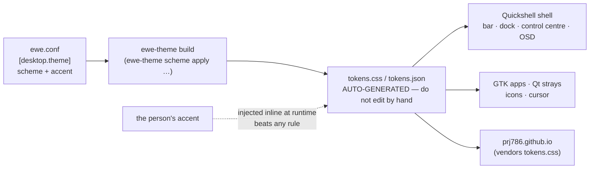

---
tags:
  - ewe-map
  - design
title: Design System
up: "[[Home]]"
---

# The ewe design system

Lives in `ewe/design/` (version 3). One token layer decides every value; no
component carries a palette literal. **One accent in, a whole system out.**

## The pipeline

- **Roles, not values** — a component asks for a role (`--surface-raised`,
  `--control-md`); the token layer decides the value.
- **Two dark schemes, no light mode** — `flock` (neutral greys),
  `blacksheep` (absolute black for OLED). Dark by decision.
- **Type styles** — classes (`.body`, `.label`) alongside the custom
  properties.
- **Guards** — `check-contrast.sh`, `check-icons.sh`, `check-spec.sh`,
  `check-tokens.sh` keep the system honest; `specimen.html` shows it.

## Where the design lives

| path | what |
|---|---|
| `ewe/design/system/` | the source of truth (v3): tokens, components, guidelines |
| `ewe/design/tokens.css` | generated output — the token layer itself |
| `ewe/design/components.css` | component styles |
| `ewe/design-mockups/*.html` | quick HTML mockups: topbar, dock, control centre, Komble, settings, sync |

## Related

- [[Mockups and Screenshots]] · [[Website]] · [[ewe Desktop]] ·
  [[The One File]]

> **Build guard:** `tokens.css` is generated — edit the system, not the
> output; no raw colour/size/duration anywhere outside `bin/ewe-theme`;
> read `design/system/guidelines/40-implementation.md` before UI work.
> Foundation rationale: [[Foundation Choices]].
