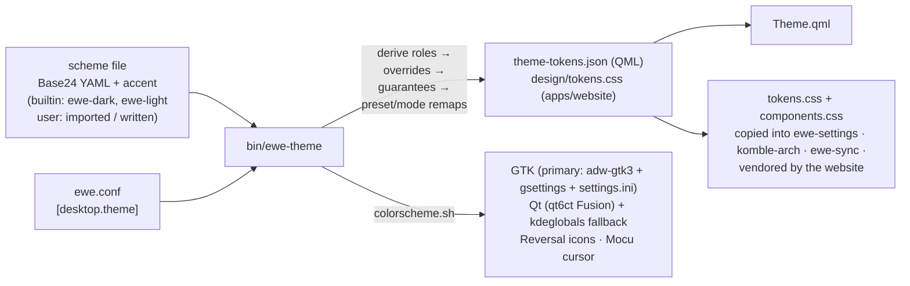

---
tags:
  - ewe-map
  - design
title: Theming Pipeline
up: "[[Home]]"
---

# Theming Pipeline — scheme in, whole system out

The design system v3 (`ewe/design/system/`, 86 components) is the source of
truth for every surface. The pipeline turns **one Base24 scheme + one
accent** into every colour, size, type style and motion value the shell,
GTK/Qt apps, the greeter and the website use.



## The derivation (what the generator guarantees)

- **Roles, not values** — components read `surface-*`, `text-*`, `border-*`,
  `accent*`; never raw hex. `--accent` is the person's pick, injected inline
  at runtime, and beats any rule.
- **Guarantees** — text 4.5:1, borders/focus 3:1, surfaces ≥ 2 L apart,
  `warning` ≠ accent hue; every adjustment recorded in `adjusted` and shown
  by `scheme show`.
- **The floor and ceiling** — `black` (#020202) and `neutral-0` (#fefdfc)
  bound every emitted colour (`in_range`); never add a literal hex outside
  the FOUNDATIONS tables.
- **Remaps** — look presets (`corner` medium/small/large, `density`
  comfortable/compact/roomy, `stroke` thin/none/thick) and accessibility
  modes are remaps of a few tokens, applied by the generator. Components
  never check which scheme/preset/mode is active.
- **Accent ramp** — accent roles and the `ewellow-*` scale are generated
  from the pick; `on-accent` flips black/white to hold 4.5:1. `ewellow`
  (#eeb407) stays the brand colour for logo/installer/wallpapers.

## ewe-theme CLI

```
scheme list · show · apply <slug> · import <file|URL> [--name --slug --accent --flavour --apply]
scheme export [slug] · set <field> <value> · from-wallpaper [--light] [--apply]
scheme duplicate · remove <slug>
set overrides.<role> <hex|none>          # edit one override
build --scheme SLUG --selector SEL       # CSS for another scheme without touching ewe.conf (website toggle)
```

Imports: Base16/24 YAML, Omarchy `colors.toml`, Catppuccin `palette.json`
(pick a flavour), Gogh YAML; wallpaper via ImageMagick histogram (Pillow
fallback). Builtin schemes refuse `set`/`remove`. User schemes live in
`ewe.conf` as `[desktop.theme.schemes]` records — so they **sync with the
rest of the file**.

## Fonts (the rules that bit before)

- Faces: **Geist** + **Geist Mono** (OFL, variable woff2, shipped in
  `dotfiles/quickshell/fonts/geist/` and to `/usr/share/fonts/ewe/` for the
  greeter — the greeter is another user and reads no dotfiles).
- **Geist has no Georgian glyphs** → every stack prefers **Noto Sans
  Georgian** next, and **Georgian is NEVER uppercased** (small headers are
  the `overline` style: letters spaced, case unchanged).
- kitty gets the Nerd PUA mapped to Symbols Nerd Font Mono.
- `mono-numeric` for values that change in place (clock, battery).

## Toolkit writing (`colorscheme.sh <mode> [accent]`)

One pass writes every toolkit's config: **GTK is primary** (adw-gtk3 +
gsettings + `gtk-3.0/4.0/settings.ini`); Qt gets a dark Fusion palette via
`qt6ct`; `kdeglobals` covers any KDE app added later; Reversal icon theme
hue-matched to the accent; Mocu cursor forced everywhere (`XCURSOR_THEME`,
GTK, gsettings, qt6ct). `set -u` not `-e` **on purpose** — a stray non-zero
line must never abort before all files are written. Mode argument accepted
and ignored: **dark-only by decision**.

## Wallpaper backends (per file type, picked automatically)

| content | backend | notes |
|---|---|---|
| video (mp4/webm/mkv/mov/avi/m4v) | **mpvpaper** | one instance per output, looped, muted by default |
| image / animated GIF | **swww** (Arch: `awww`) | GIFs animate; transitions |
| image, no swww | **swaybg** | static; GIFs show a warning |

Per-output resolution via `wallpapers.conf`; `backend=swaybg` forces static.
(hyprpaper was dropped in 0.3.)

## Implementation status (the phases)

1. tokens + generator ✓ · 2. fonts + icons ✓ · 3. Theme.qml ✓ · 4. shell
components ✓ · 5. app CSS + components ✓ · 6. Ewe names only ✓ (Fluent
aliases and the old `themes` block deleted; migration table in
`guidelines/20-migration.md`). Text-size scaling scales type AND control
heights; the bar steps icon size at 130, the dock keeps its cells. **Never
wrap a `control*` in `Theme.grow()` — it has grown already.**

## The guard rails for implementers

`guidelines/40-implementation.md` (written for AI sessions!): the system is
truth for **looks**, the code is truth for **behavior**; use tokens, never
raw values; if a value has no token, **add the token first**; don't remove
anything a card omits; one commit per phase; check each phase before the
next. Versioning lives in the changelog — raise the version on any token or
component change.

## Related

- [[Design System]] · [[Shell Singletons]] · [[Foundation Choices]] ·
  [[Roadmap — Desktop and One File]]
