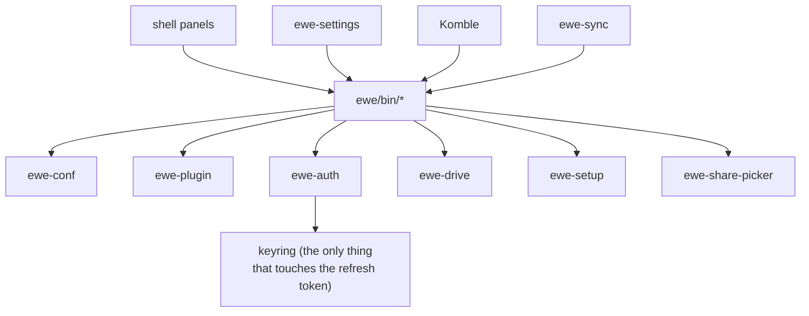

---
tags:
  - ewe-map
  - development
title: CLI Tools
up: "[[Home]]"
---

# CLI Tools — every GUI is a front end

> Every graphical thing here is a front end to one of these, so anything
> you can click, you can script — and debug by running the same command
> yourself.

All in `ewe/bin/`. Every one prints JSON and exits 0, so callers never hang
on them.

## The roster

| tool | job | verbs |
|---|---|---|
| **`ewe-conf`** | [[The One File]] — the only writer | `get` · `set` · `dump` · `import` · `apply` · `push` · `pull` · `path` · `sync-status` |
| **`ewe-plugin`** | [[Plugin System]] | `add` · `list` · `info` · `enable` · `disable` · `update` · `remove` · `restore` · `validate` · `seed` · `path` · `create` · `dev` · `place` · `set` · `get` |
| **`ewe-auth`** | [[Auth Broker]] — one Google identity for every app | `status` · `login [--with-mail]` · `token` · `logout` · `keyring-reset` |
| **`ewe-drive`** | your Drive as a folder (optional Google extra) | `setup` · `mount` · `unmount` · `status` |
| **`ewe-cloud`** | the Nextcloud account tool (Login Flow v2) | `login <server>` · `status` · `token` |
| **`ewe-files`** | mount the account at `~/Nextcloud` (rclone remote from keyring) | `setup` · … |
| **`ewe-caldav`** | CalDAV calendar sync for the shell widget | — |
| **`ewe-mail`** | IMAP mailbox for the Control Centre badge | — |
| **`ewe-theme`** | [[Theming Pipeline]] — schemes, tokens, imports | `scheme list/show/apply/import/export/set/from-wallpaper/duplicate/remove` · `set overrides.*` · `build` |
| **`ewe-bt`** | bluetooth pairing for the Settings app (same as BtAgent) | — |
| **`ewe-globalshortcuts`** | portal global shortcuts (1Password Quick Access…) | — |
| **`ewe-pass`** | the tool behind the [[Passwords Plugin]] picker | `status` (says what it will do and why not) |
| **`ewe-setup`** | per-user deployment of the installed payload | — |
| **`ewe-share-picker`** | the portal's screen-share picker, backed by the shell | — |

The website documents each tool: `prj786.github.io/docs/cli/<tool>`.

The refresh token lives only in the keyring — `ewe-auth` is the single thing
that touches it.

## Related

- [[The One File]] · [[Auth Broker]] · [[Plugin System]] · [[Repo Layout]]
