---
tags:
  - ewe-map
  - development
title: Repo Layout
up: "[[Home]]"
---

# Repo Layout — inside the `ewe` repo

The main repo's anatomy (the other repos follow the same family pattern:
`src-tauri/` + `src/` for the Tauri apps, `packaging/` everywhere).

```mermaid
flowchart TB
    ROOT["ewe/"] --> BIN["bin/ — the CLI tools<br/>ewe-conf · ewe-plugin · ewe-auth<br/>ewe-drive · ewe-setup · ewe-share-picker"]
    ROOT --> DOT["dotfiles/<br/>hypr/ (Lua config, SHORTCUTS.md)<br/>+ other app dotfiles"]
    ROOT --> SYS["system/<br/>branding · greeter · greetd · plymouth ·<br/>pam.d · dconf · nemo-actions · udev · …"]
    ROOT --> PH["phases/<br/>00-preflight → 90-postcheck<br/>(installer phase scripts)"]
    ROOT --> PACKAGES["packages/<br/>common.list · dev.list · gaming.list ·<br/>aur.list · patched/"]
    ROOT --> PACKAGING["packaging/ — PKGBUILD, package plumbing"]
    ROOT --> DESIGN["design/ — design system v3<br/>tokens.css (generated) · components · guidelines"]
    ROOT --> DOCS["docs/<br/>RFC-001 … RFC-006 · MANUAL · PLUGINS ·<br/>EWE-CONF · SETTINGS-BACKEND · NEXTCLOUD ·<br/>GOOGLE-CLIENT · TROUBLESHOOTING"]
    ROOT --> LIB["lib/ · scripts/ · templates/ · systemd/"]
    ROOT --> TESTS["tests/"]
    ROOT --> TOP["install.sh · update.sh · uninstall.sh ·<br/>release.sh · get.sh · VERSION · VERSIONS ·<br/>CLAUDE.md · CONTRIBUTING.md · SECURITY.md"]
```

## The interesting corners

- **`phases/`** — the system-setup scripts that run in order: repos,
  packages, services, hibernate, bootsplash, microcode, GPU, dotfiles,
  userconfig, postcheck. (`/usr/share/ewe/install.sh` orchestrates.)
- **`design/`** — the design system; the website vendors `tokens.css` from
  here (see [[Design System]]).
- **`docs/`** — the RFCs are the project's decision memory (see
  [[Roadmap and Status]]).
- **`packages/`** — package lists per use case; `patched/` for patched
  packages; the AUR list feeds the ewe-repo prebuilds.
- **`bin/`** — the tools every GUI fronts (see [[CLI Tools]]).

## Related

- [[CLI Tools]] · [[ewe Desktop]] · [[Worktrees and Screenshots]] ·
  [[System Architecture]]
