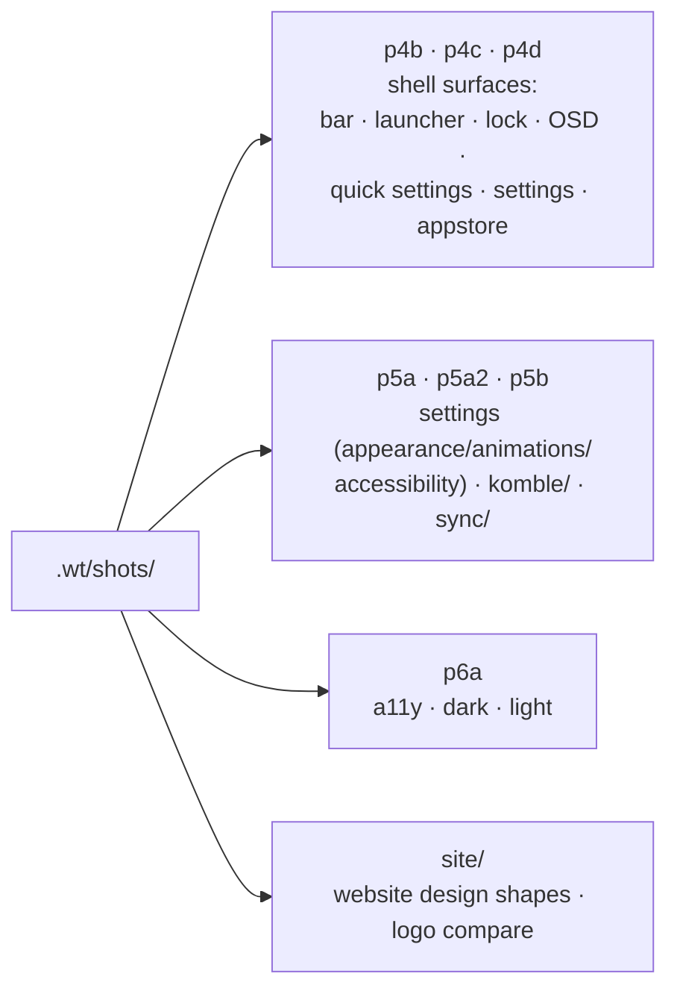

---
tags:
  - ewe-map
  - development
title: Worktrees and Screenshots
up: "[[Home]]"
---

# Dev worktrees & the screenshot archive

The workspace root carries two dev-side folders beyond the repos:

- **`.wt/`** — git worktrees used as sandboxes during development, each
  with its own session logs and screenshot harvests.
- **`.claude/settings.json`** — Claude Code workspace settings (the project
  is "designed and built by scubba, pair-programmed with Claude Code").

## The worktrees

| worktree | what it holds |
|---|---|
| `.wt/hs-4d` | `hs` = hypr-shell era: dozens of `set-*.png` sheets, bars, launcher, settings, a11y crops, plus `hypr.log` / `qs.log` |
| `.wt/hs-6a` | another shell-era sandbox |
| `.wt/hs-main` | current shell shots: `launcher.png`, `overview.png`, `quicksettings.png` + logs |
| `.wt/p4d-conf` | config-era sandbox |
| `.wt/shots/` | the curated screenshot archive, phase-tagged: `p4b`, `p4c`, `p4d`, `p5a`, `p5a2`, `p5b` (komble/, sync/), `p6a`, `site` |

## The screenshot archive (`.wt/shots/`)

The archive doubles as the **accessibility audit trail** — every phase
carries `a11y-*` shots and contrast runs (`a11y-contrast-130.png` etc.).

A curated subset is embedded in [[Mockups and Screenshots]].

## Related

- [[Mockups and Screenshots]] · [[Design System]] · [[Repo Layout]]
