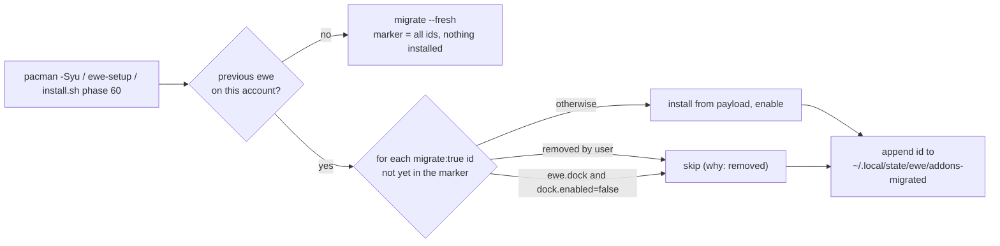

---
tags:
  - ewe-map
  - decisions
title: Add-ons — one-time migration for upgraders
up: "[[Decision Index]]"
---

# Upgrades keep what users had — `ewe-plugin migrate` (D3)

**Decided 2026-10-04** (ewe 0.25.0-beta). Carving a feature out of the
shell must not take it away from the people who had it.

- `ewe-plugin migrate` installs and enables, **once**, the add-ons that
  replace features the user had built in (every `migrate: true` id in
  `bundle.json`) — the dock only unless `[desktop.dock] enabled = false`,
  and **never one the user had removed** (`[plugins].removed`).
- It runs from `ewe-setup` and from `install.sh` phase 60 when a previous
  ewe is detected. `EWE_PREVIOUS` is decided in `install.sh` **before phase
  50** (an older `~/.local/share/ewe/VERSION` or a deployed config); a
  fresh machine runs `migrate --fresh`, which **records the ids as
  considered and installs none**.
- **Marker:** `~/.local/state/ewe/addons-migrated` — **local, never
  synced** (not in `ewe.conf`, which travels to the cloud). It is a **JSON
  list of the ids already considered**, not a boolean, so an add-on that
  moves out of the shell in a *later* release is still migrated once for
  the people who had that feature.
- JSON result: `migrated`, `skipped` (with `why`), `fresh`; errors are
  `{ok:false}` + exit 1 (the `validate --json` precedent).

> **Build guard:** the marker is per machine and per id — never move it
> into `ewe.conf`, never make it a single flag. *Breaks if violated:* a
> synced flag would stop a second machine from migrating, and a boolean
> would skip every add-on extracted after the first migration ran.

## Related

- [[Add-ons — opt-in, not preinstalled]] · [[Add-ons — vendored payload and bundle.json]] ·
  [[Plugin System]] · [[Install Flow]] · [[Storage Map]]
