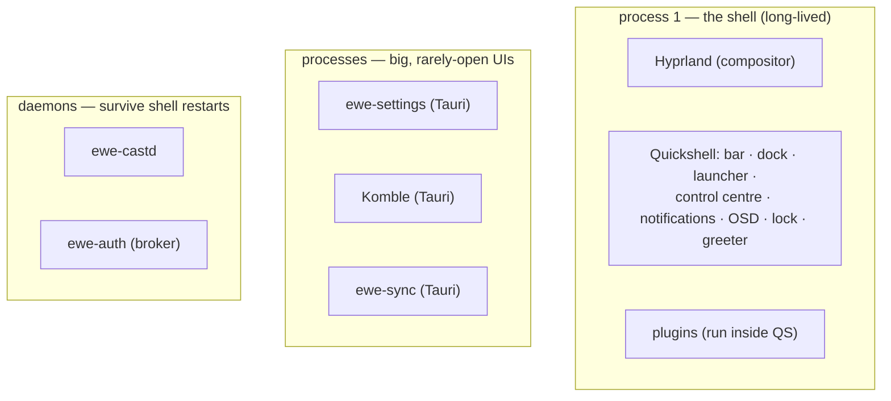

---
tags:
  - ewe-map
  - decisions
title: Process Split — Shell vs Apps
up: "[[Home]]"
---

# Process Split — what runs where, and why

The desktop is deliberately split across processes. Getting this wrong in
either direction is the classic failure mode.

## Why the shell is one process

Everything that must be a **Wayland layer-shell surface** — bar, dock,
notifications, OSD, lock — stays in Quickshell, because **Tauri cannot
create layer-shell surfaces at all**. Those surfaces are also why the shell
is one long-lived process: they're always on screen.

The cost: a QML error takes the whole desktop down. That's accepted — and
it's the reason everything *else* moved out.

## Why the big UIs are separate Tauri apps

Settings, Komble and ewe-sync are **ordinary windows** — they don't need
layer-shell. Moving them out:

- keeps large, rarely-open UI out of the shell process (crash isolation);
- gives each its own memory/lifecycle (Komble's tray, ewe-sync's tray);
- lets them be written in Tauri (Rust) + Svelte instead of QML.

The in-shell Settings/AppStore panels remain **only as fallbacks** while
the binaries are absent (`Globals.openStore()/openSettings()` launch the
binaries when present).

## Why the daemons are daemons

Casting and auth must **survive shell restarts** and want real threads /
independent lifecycles — see [[RFC-004 — ewe-castd, Python not Rust]] and
[[RFC-002 — Auth Broker]]. Rule: *state that outlives the shell lives
outside the shell.*

## Anti-regression notes

- Don't move a layer-shell surface into a Tauri app (impossible) or into a
  separate process (it would lose the shared Theme/Globals singletons and
  IPC).
- Don't move Settings back into the shell (a QML error there would take the
  desktop down).
- Don't put casting state in the shell (a shell crash would drop the call).

## Related

- [[Desktop Shell]] · [[ewe-settings]] · [[Decision Index]] ·
  [[System Architecture]]
